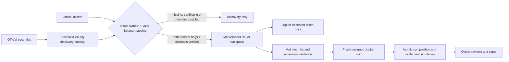

# Backpack integration audit

Reviewed 16 September 2026. The proposal is implemented with a strict distinction between exchange discovery, official Solana mappings, and an executable wallet order.

## Observed API evidence

The public `/securities` endpoint returned **1,165** listings. Joining their exact `.US` symbols to `/assets` yielded **1,155** valid Solana addresses, of which **49** had both deposits and withdrawals enabled. `/markets` exposed only **four** visible stock spot books: SPCX, MU, SNDK and SKHY. Stock perpetuals are excluded. These are timestamped observations, not fixed product counts. The official API documents session-based stock RFQs and spot trading outside sessions only for listed books. [Backpack API](https://docs.backpack.exchange/)

The complete read-only observation, endpoint timestamps, response hashes and eligible mappings are in [the dated audit](audits/backpack-catalog-2026-09-16.json). Reproduce it with:

```sh
pnpm build:sdk
node scripts/audit-backpack-catalog.cjs
```

## Corrections to the proposal

- `backpack:AAPL.US` is a discovery ID, never an SPL mint. No address is derived from a ticker or copied from a similarly named token.
- A security listed by Backpack is not necessarily transferable on Solana, liquid on Jupiter, or available to every user. There is no blanket promise of 24/7 executable trading across the catalog.
- Backpack describes **traditional brokerage holdings** as UCC Article 8 entitlements. Its comparison distinguishes tokenized holdings as claims on an SPV. The same page describes dividend reinvestment and proportional corporate-action adjustments for tokenized securities; these should be presented as the provider's product terms, not rights guaranteed by Kite or every discovery row. [Backpack holding models](https://learn.backpack.exchange/articles/how-to-hold-spcx)
- Backpack's introduction describes conversion through deposits and withdrawals, with access through its brokerage infrastructure. Eligibility and current transfer availability still apply. Kite does not create an exchange account, submit an RFQ, claim brokerage custody, or perform mint/redemption. [Backpack Securities introduction](https://learn.backpack.exchange/blog/introducing-backpack-securities)

## Implemented boundaries



`MarketSnapshot.backpackSecurities` holds all validated discovery entries separately from `assets`. It preserves source sessions, official mint when available, transfer flags and observed spot books. `backpackObservedAt` records the catalog observation. Price, volume and asset classification are not invented; `/securities` does not supply a reliable equity/ETF classification.

Only unambiguous mapped tokens with supported decimals and both transfer flags enter the mainnet token-price pipeline. Their prices come from Jupiter's token APIs, never an exchange stock reference quote. Prices remain unavailable until observed. Basket definitions continue to select their explicit issuer and cannot silently substitute a Backpack token for an xStock with the same underlying symbol.

Known discovery-only Backpack mints are rejected at both the trade API and the transaction builder, including attempts to reach them through generic token search. A new-format catalog missing Backpack mapping data fails issuer completeness checks. Existing mainnet RPC identity, precision, unsupported-extension, destination, debit, wallet-capability and simulation checks remain in force. No program or token was deployed for this integration.

## Verification

`packages/sdk/test/backpack.test.cjs` covers fake IDs, invalid/conflicting mints, unsupported transfer states, missing precision, discovery-preserving outages, strict spot/perpetual separation and pricing only eligible official mints. Existing catalog tests isolate the provider and retain their missing-data and allocation invariants.
