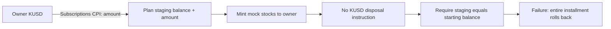

# Devnet recurring contract audit — 16 September 2026

Reviewed upstream `6dc2d2edd4a24e00f05f455cbfa04d54948ba57d`, the current mock-mint Guard, SDK bindings, `/api/recurring/*`, provisioning script, and public devnet accounts. **The mock-mint recurring flow is not ready for a successful end-to-end installment.** There are independent creation and execution blockers below. Contract logic has deliberately not been changed, as requested in `TODO.md`.

This is a source and integration review, not a third-party security audit or proof that the deployed binary matches this commit. No wallet key was loaded, no transaction was signed, and nothing was minted, swapped, deployed, or broadcast. Public RPC account reads and local fixture tests were used.

## Verified public devnet state

Read-only verification at confirmed slot **499377569**, using `https://api.devnet.solana.com`:

| Check | Observed result |
|---|---|
| Genesis hash | `EtWTRABZaYq6iMfeYKouRu166VU2xqa1wcaWoxPkrZBG` — devnet |
| Guard program | `8Fm9HENPAFnyo6L8cHJFx62HHsZ6ez6CPUDuzgKAzrjs`, executable |
| Guard last deployment slot | `498935540` |
| Guard upgrade authority | `FsHawHBmgvn5uGZHDWt2NQMbpFGFnCqiC4Knmw31NCrr` |
| Official Subscriptions | `De1egAFMkMWZSN5rYXRj9CAdheBamobVNubTsi9avR44`, executable; last deployment slot `480013438` |
| Derived mock mint authority | `GCT4iZ7JQdW5mHg3Cr1xM75Tsmv1mFnxNTVokRidzmPP`, from `[b"mock_mint_authority"]` and the Guard program ID |
| Mock stock mints | **40/40** exist, use classic SPL Token, have six decimals, have no freeze authority, and have the Guard PDA as mint authority |
| KUSD mint | `jaViZzZ2ezVSKXZvyQnrmasSyBWVU5n8VMx4ZuAovjM`, initialized classic SPL, six decimals, no freeze authority |
| KUSD mint authority | `FsHawHBmgvn5uGZHDWt2NQMbpFGFnCqiC4Knmw31NCrr`, retained as the funding/faucet authority |
| V1 transaction feature | Activated at slot `492480000` |

The 40 stock authority transfers are already complete; do not repeat them. A deployed executable and correct mint authorities do **not** establish that plan creation or collection works. The guide's example `4zMMC…ncDU` funding mint is not the manifest's current KUSD mint.

Reproduce the public checks without a Solana CLI or wallet:

```bash
node scripts/audit-devnet-recurring.mjs
```

The script reads only the public manifest and chain accounts, batches account reads, rejects non-devnet genesis hashes, reports funding and stock authorities separately, and explicitly returns `contractExecutionVerified: false`. An optional `KITE_RECURRING_RPC_URL` or `SOLANA_DEVNET_RPC_URL` can select another devnet RPC. It never inherits the mainnet `SOLANA_RPC_URL`.

## Findings requiring review

Severity is scoped to this devnet demonstration: **High** blocks the intended flow or its critical guarantees; **Medium** breaks cancellation/readiness or creates a preventable security/operational hazard. These are recommendations for a subsequent approved fix, not implemented contract changes.

### F1 — High: SDK and Rust derive different plan PDAs

Sources: [SDK `findGuardPlanPda`](../packages/sdk/src/guard/devnet.ts#L123), [Rust creation seeds](../packages/anchor/programs/kite_guard/src/instructions/create_plan.rs#L18), [Rust execution seeds](../packages/anchor/programs/kite_guard/src/instructions/execute_swap.rs#L14).

The SDK uses `b"plan"`; Rust uses `b"plan_v2"`. SDK setup creates the staging ATA and official delegation for the former address, then passes it to a Rust instruction that requires the latter. Creation fails the seed constraint; an account created by a corrected external client is also rejected by the SDK's identity validation.

Reproduced locally with synthetic public keys and nonce `42`: SDK plan `FMQVEicrwf5HY1HVSc8y9soFbCrsLFqvCqQ2HrwRWVas`, Rust plan `E2VYS9hM2UPEoTQ5Mrr7K4sUtZGNrA9QsEhVnP7Y7Nrp`.

Recommended fix: retain the intended Rust seed consistently in every SDK builder/decoder, generated IDL, and fixture. Add a test deriving the expected PDA from the actual IDL seed bytes, followed by a local runtime setup using the official Subscriptions binary.

### F2 — High: Subscriptions validation uses the wrong PDA and account layouts

Source: [`validate_subscription`](../packages/anchor/programs/kite_guard/src/utils.rs#L114). Comparison source: the installed `@solana/subscriptions` **0.5.0** generated `findSubscriptionAuthorityPda`, `getSubscriptionAuthorityDecoder`, `getHeaderDecoder`, and `getRecurringDelegationDecoder`; [SDK wrappers](../packages/sdk/src/subscriptions/mainnet.ts#L30) use those official codecs.

Rust derives `[b"authority", owner, mint, nonce]`. The official program derives `[b"SubscriptionAuthority", owner, mint]`, with the nonce on the recurring delegation instead. Even after F1 is fixed, official setup cannot pass this check.

The Rust offsets also disagree with the official codecs:

| Field | Official offset | Current Rust offset |
|---|---:|---:|
| Authority `initId` | 98 | 41 |
| Delegation owner | 3 | 9 |
| Delegation delegatee | 35 | 41 |
| Delegation payer | 67 | 73 |
| Delegation `initId` | 99 | 137 |
| Delegation authority | 107 | Not decoded/compared |
| Delegation mint | 139 | 105 |
| Current period start | 171 | 145 |
| Period seconds / expiry / amount / pulled | 179 / 187 / 195 / 203 | 153 / 161 / 169 / 177 |

Official account sizes are 106 bytes for authority and 211 bytes for recurring delegation. The current parser checks only nonempty data, slices without length guards, does not check account discriminator/version, and never derives the canonical delegation address. Malformed program-owned inputs can panic; the reviewed path does not establish a theft exploit, because downstream Subscriptions still validates its own transfer.

Recommended fix: decode and validate the official layouts, account identity, discriminator/version, authority generation, and canonical delegation PDA. Reject short data with a controlled error. The **transfer CPI encoding itself is correct**: discriminator `5`, amount, delegator, mint, nine account metas, and only the plan PDA signer match the official 0.5 SDK.

### F3 — High: every positive collection leaves staging funded and then rejects it

Source: [`execute_swap` collection and final balance assertion](../packages/anchor/programs/kite_guard/src/instructions/execute_swap.rs#L134).

After the transfer CPI, the handler requires `staging_after = staging_before + funding_amount`. It then only mints output tokens; no instruction removes KUSD from staging. At line 170 it requires `staging_after = staging_before`. Creation requires a positive funding amount, so these conditions cannot both hold. Once earlier blockers are repaired, every installment still fails atomically and rolls back collection and output mints.



Recommended decision before editing: specify what collected **test KUSD** means. A burn of exactly the collected amount is a simple devnet consumption model that preserves staging neutrality, but it is a behavior decision for the owner to approve. Do not merely remove the invariant and quietly accumulate a funding vault; do not replace this mock demonstration with an unnecessary swap.

### F4 — High: output checks reject wallets with any existing stock balance

Source: [`before_outputs` and output delta checks](../packages/anchor/programs/kite_guard/src/instructions/execute_swap.rs#L107).

All `before_outputs` are set to zero. After minting `amount`, the handler requires the destination's **total balance** minus zero to equal `amount`. Existing balances fail; even a first successful installment into an empty account would make the next installment fail. The handler also slices remaining accounts without checking that there are exactly two per output.

Recommended fix: validate and snapshot every output token account before any CPI; compare its actual after-minus-before delta, and check the remaining account count first. For the documented ATA-only guarantee, require the canonical owner ATA instead of only `destination.owner == plan.owner`. Verify mint ownership, address, writability, and mock authority before collection.

### F5 — Medium: closing a Guard plan does not revoke its Subscriptions delegation

Sources: [Rust `close_plan`](../packages/anchor/programs/kite_guard/src/instructions/close_plan.rs#L30), [SDK close builder](../packages/sdk/src/guard/devnet.ts#L676), [API revoke preparation](../apps/web/lib/server/recurring-devnet.ts#L530).

The current transaction recreates the owner funding ATA, transfers residual staging funds, closes staging, and closes the plan. It contains no Subscriptions revoke instruction or CPI. The delegation account and its rent remain, although the API describes the operation as revocation. A closed plan cannot execute through the existing handler, but that is different from removing the on-chain permission.

Recommended fix: owner-signed official delegation revocation in the same transaction, while still allowing cleanup if a delegation was already removed. Test actual delegation-account closure. Also preserve cancellation when a funding account is frozen: the current `require_no_freeze_authority`/frozen-token checks can prevent cleanup, despite the older runtime test expecting it to work.

### F6 — Medium: readiness and mint validation overstate what the API knows

Sources: [`getDevnetRecurringConfig`](../apps/web/lib/server/recurring-devnet.ts#L169), [output construction](../apps/web/lib/server/recurring-devnet.ts#L331), [`prepareOrder`](../apps/web/lib/server/recurring-devnet.ts#L230).

Config marks manifest-listed stocks available after genesis/V1 checks; it does not inspect their live mint authorities or the deployed Guard capability. Its text promises a protocol simulation, but preparation only simulates the requested transaction, and the Rust entrypoint no longer has `protocol_version`. Creation does not pass output mint accounts to Guard and does not verify them on the server, so a future unavailable/incorrect stock authority can allow a plan to be created but fail only when collected.

Recommended fix: verify stock authority against the derived mock PDA before creation, distinguish catalog/authority checks from execution readiness, and demonstrate an actual create–collect–close runtime flow. Keep the current exact-transaction simulation and fail-closed preparation. Mock delivery is a fixed amount in raw token units; the API currently sets it from KUSD allocations, **not stock prices**, and the UI/guide should call it a test allocation rather than an equity quote. Pool/slippage error text is obsolete in mock mode.

### F7 — Medium: provisioning assumes one authority after authorities have split

Sources: [provisioner authority validation](../scripts/create-devnet-xstocks.cjs#L157), [public manifest](../apps/web/public/xstocks-devnet/xstocks.json).

The manifest's single `mintAuthority` is now the Guard PDA. All stock mints match it, but KUSD correctly remains under the faucet wallet. The script checks **every** recorded mint against the one manifest authority, and a provisioning run insists that the payer also equal that authority. No wallet keypair can sign as a PDA. Thus the current script cannot resume/extend this migrated catalog without separating payer/funding authority from stock mint authority.

Recommended fix: add explicit authority roles to the manifest/provisioner, preserve all existing mint addresses, and treat post-transfer stock mints as immutable provisioning results. Do not transfer KUSD to the Guard PDA: the Guard has no funding-faucet instruction. The batched audit script added with this report handles this split correctly. The old `--dry-run` was attempted but stopped on public RPC HTTP 429 before completing all sequential reads; its full result is not claimed as a pass.

### F8 — Medium: a private provisioning checkpoint was tracked in Git

Upstream tracks `.env.kite-devnet-xstocks-state.json`. A schema-only inspection found **41 arrays of 64 bytes** under `mints`; [the provisioner writes these as mint keypairs](../scripts/create-devnet-xstocks.cjs#L109). No key bytes are reproduced here.

These are **mint account keypairs**, not the retained payer/mint-authority wallet key. Once an initialized mint is owned by SPL Token, its original address keypair alone does not grant mint authority. Therefore this is an exposed secret checkpoint and cleanup issue, not evidence of stolen mint authority. Stop tracking it, add an exact ignore rule, and preserve the local checkpoint for recovery. Deleting it in a new commit does not erase history; review where it was published and never reuse these keys for any other purpose. Do not rotate the existing public mint addresses blindly.

### F9 — Medium: passing unit tests do not exercise the new contract integration

Sources: [SDK fixtures](../packages/sdk/test/guard-devnet.test.cjs), [runtime fixture](../packages/anchor/tests/runtime.test.cjs#L49), [Rust schedule validation](../packages/anchor/programs/kite_guard/src/utils.rs#L27).

After rebuilding the SDK, all 25 targeted SDK/API tests pass. They compare JS-generated fixtures or mocked RPC results, and therefore miss F1–F4. The runtime suite still encodes `planV2`, allocates 1684-byte CPMM plans, provisions Raydium pools, and expects a removed `protocol_version` instruction. It is not a mock-mint runtime suite. Its seven tests could not run here because `subscriptions.so` is absent; Rust/Solana/Anchor CLIs are not installed, so no fresh native/SBF build or IDL regeneration was verified.

Additional gap: the API permits at most 365 periods, but Rust only caps duration and requires `periods > 0`. A direct client can supply 366 valid 60-second periods. The native test's 366-period case also changes expiry inconsistently, so it does not prove the intended period cap. `devnet_mock` is stored but not required or branched on in execution; API genesis checks are the effective network boundary. This source must not be deployed for real mainnet tokens.

Recommended acceptance tests: fresh generated IDL/PDA parity; official Subscriptions setup; first and second stock installments with preexisting output balances; multi-stock basket collection; exact KUSD handling and untouched incidental donations; failed later mint rolls back all balances and counters; replay/stale/expired rejection; non-owner close rejection; actual permission revocation; and strict devnet rejection before account reads or broadcasting.

## What is already enforced

- Create requires the owner's signature. Execute requires only a fee payer signature and uses a plan PDA for Subscriptions collection and a separate PDA for minting. No keeper wallet token authority is needed.
- Schedule checks prevent early execution, same-period replay, backfill of missed periods, and execution after expiry. Positive output weights sum to 10,000 bps, duplicate output mints are rejected, duration is bounded to a year, and output owner/mint are checked.
- Web recurring RPC does not inherit the mainnet trading RPC. Creation/collection/close/listing and signed execution check the actual RPC genesis. Request policies reject caller-supplied network/mint/instructions and legacy schemas.
- Signed execution verifies HMAC authorization for the exact message, devnet genesis, V1 format, expiry, and a real Ed25519 signature. It rechecks genesis before broadcast, and uncertain responses retain the same signature for recovery. The tests for mainnet RPC substitution and message mutation pass.
- These positive checks do not cancel the independent failures above. The reviewed API behavior is fail-closed, not a demonstrated successful recurring purchase. Mobile must also use `/api/recurring/*` rather than legacy mainnet `/api/investing` for its SIP screen.

## Reproduction and owner-run commands

Run local checks with the repository's pinned pnpm; a fresh SDK build is required because stale ignored `dist/` can produce misleading test results:

```bash
npx pnpm@10.31.0 install --frozen-lockfile
node node_modules/typescript/bin/tsc -p packages/sdk/tsconfig.json
node --test packages/sdk/test/guard-devnet.test.cjs apps/web/tests/recurring-devnet.test.mjs apps/web/tests/devnet-authority-audit.test.mjs
node scripts/audit-devnet-recurring.mjs
```

Observed: SDK build passed; **29/29** tests passed (25 existing + four public-authority audit regressions). `node --test packages/anchor/tests/runtime.test.cjs` failed all seven tests at fixture loading, before contract execution, due to missing `packages/anchor/target/test-programs/subscriptions.so`.

On a machine with the project's Rust/Anchor/Solana toolchain, these commands build/check locally and do not deploy:

```bash
cargo test --manifest-path packages/anchor/Cargo.toml -p kite_guard
node packages/anchor/scripts/sync-idl.cjs --check
node packages/anchor/scripts/fetch-runtime-programs.cjs
cargo build-sbf --manifest-path packages/anchor/programs/kite_guard/Cargo.toml --sbf-out-dir packages/anchor/target/test-programs
node --test packages/anchor/tests/runtime.test.cjs
```

The runtime fixtures must first be adapted to the new mock ABI; downloading binaries alone will not fix that suite.

Authority checks with an installed Solana/SPL CLI are read-only:

```bash
solana --url devnet genesis-hash
solana --url devnet program show 8Fm9HENPAFnyo6L8cHJFx62HHsZ6ez6CPUDuzgKAzrjs
solana --url devnet program show De1egAFMkMWZSN5rYXRj9CAdheBamobVNubTsi9avR44
spl-token --url devnet display BjHgkKRRWoK3UAKKkN8wF3Co8XJoVL8QvzhrQy83ZWdC
spl-token --url devnet display jaViZzZ2ezVSKXZvyQnrmasSyBWVU5n8VMx4ZuAovjM
```

The existing provisioning command is `node scripts/create-devnet-xstocks.cjs /absolute/path/to/authority.json --symbols AAPL,MSFT`. **It is not appropriate for the current migrated manifest until F7 is fixed**. Existing 40 stocks need no further provisioning or authority transfer. For a newly provisioned stock only, the owner can transfer its authority after verifying the exact mint and local authority public key:

```bash
spl-token --url devnet authorize NEW_STOCK_MINT mint GCT4iZ7JQdW5mHg3Cr1xM75Tsmv1mFnxNTVokRidzmPP --owner /absolute/path/to/authority.json --fee-payer /absolute/path/to/authority.json
```

Do not use that command for KUSD. No one can sign using a private key for the Guard PDA; only the Guard program can sign for it.

Only after findings are resolved, runtime tests pass, and the user has reviewed the exact resulting binary, the owner can build and upgrade devnet:

```bash
# Run from packages/anchor after verifying the configured program ID.
anchor build
solana --url devnet program deploy target/deploy/kite_guard.so --program-id 8Fm9HENPAFnyo6L8cHJFx62HHsZ6ez6CPUDuzgKAzrjs --upgrade-authority /absolute/path/to/upgrade-authority.json --keypair /absolute/path/to/fee-payer.json
```

The upgrade-authority file must resolve to the currently observed authority above, or an authority verified by a fresh `program show`. These are owner-run instructions, not actions performed during this audit. Keep private key files outside the repository. A cron worker remains separate work; `/api/recurring/collect` prepares a transaction and does not sign or automatically execute it.
