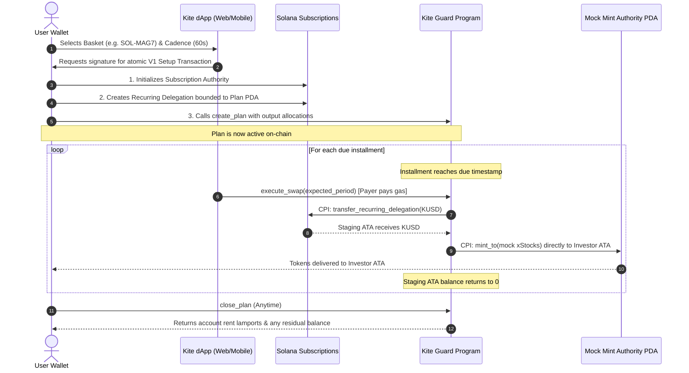

# Hackathon Guide: Devnet Recurring Investing (Kite Guard)

> Status — 16 September 2026: pause execution/setup steps until the [current contract audit](devnet-contract-audit.md) is reviewed. All 40 stock authorities are already transferred; use the read-only audit command there and do not repeat authority changes. The guide’s example funding mint differs from the live manifest.

## 1. Problem Statement: Testing Equity DCA on Solana Devnet

On Solana **Mainnet-Beta**, Kite routes tokenized stock purchases (e.g. xAAPL, xNVDA, xTSLA) through Jupiter and issuer protocols (xStocks, PreStocks) using Token-2022 and SPL Token standards.

However, on **Devnet**, real tokenized equity mints, issuer compliance registries, and deep AMM liquidity pools do not exist. Attempting to simulate a Dollar-Cost Averaging (DCA / SIP) recurring investment flow on devnet by relying on synthetic low-liquidity Raydium devnet pools leads to:
- Frequent execution failures due to high slippage or unprovisioned pools.
- Rate-limiting or missing price feeds.
- Inconsistent judge experience during evaluation.

---

## 2. The Solution: Trustless Delegation + Autonomous Mint Authority

To deliver a **100% reliable, zero-downtime demonstration** without sacrificing non-custodial security principles:

1. **Non-Custodial Scheduling via Official Solana Subscriptions**:
   - The user signs an on-chain recurring delegation with the official Solana Subscriptions program (`De1egAFMkMWZSN5rYXRj9CAdheBamobVNubTsi9avR44`).
   - The delegation grants spending permissions **only** to the user's specific `plan` PDA (`8Fm9HENPAFnyo6L8cHJFx62HHsZ6ez6CPUDuzgKAzrjs`).
   - No Kite keeper wallet, team key, or centralized backend holds custody or spending rights.

2. **Atomic Execution via Kite Guard**:
   - Installments execute strictly according to schedule (e.g., every 60 seconds for rapid hackathon testing).
   - Anyone (or Kite's automated executor bot) can invoke `execute_swap` by paying the standard Solana gas fee.
   - The contract collects KUSD from the user's wallet via Subscriptions CPI into a transient staging ATA.

3. **Direct Delivery to User ATAs**:
   - Instead of swapping through a pool, the contract signs via its deterministic `mock_mint_authority` PDA:
     `GCT4iZ7JQdW5mHg3Cr1xM75Tsmv1mFnxNTVokRidzmPP` (seeds: `[b"mock_mint_authority"]`).
   - It mints the exact proportional devnet mock stock tokens (e.g., xAAPL, xMSFT, xNVDA) directly into the user's wallet ATAs.
   - The staging account is emptied in the same atomic transaction.

---

## 3. End-to-End User Flow



---

## 4. Key On-Chain Addresses (Devnet)

- **Kite Guard Program**: `8Fm9HENPAFnyo6L8cHJFx62HHsZ6ez6CPUDuzgKAzrjs`
- **Mock Mint Authority PDA**: `GCT4iZ7JQdW5mHg3Cr1xM75Tsmv1mFnxNTVokRidzmPP`
- **Official Solana Subscriptions**: `De1egAFMkMWZSN5rYXRj9CAdheBamobVNubTsi9avR44`
- **Mock Funding Token (KUSD)**: `4zMMC9srt5Ri5X14GAgXhaHii3GnPAEERYPJgZJDncDU` (or manifest-configured mint)
- **Mock Stock Tokens Catalog**: `apps/web/public/xstocks-devnet/xstocks.json`

---

## 5. Security Invariants Preserved

- **Zero Custody**: Funds are never held in an intermediary Kite vault or keeper wallet.
- **Fail-Closed Verification**: The smart contract verifies that output token accounts belong to the plan owner.
- **Strict Basis Point Conservation**: Basket weights are defined in BigInt arithmetic and must strictly sum to 10,000 bps (100.00%).
- **Bounded Duration**: Max 365 periods, minimum 60 seconds per period, hard ceiling of 1 year total duration.
- **Instant Revocability**: Investors retain full control and can revoke their delegation or close their plan at any time.

---

## 6. Commands to Run & Verify

```bash
# Verify smart contract unit tests
cargo test --manifest-path packages/anchor/Cargo.toml -p kite_guard

# Verify SDK bindings & devnet recurring tests
pnpm build:sdk
node --test packages/sdk/test/guard-devnet.test.cjs

# Verify web backend & API tests
node --test apps/web/tests/recurring-devnet.test.mjs

# Run full monorepo typecheck
pnpm typecheck

# Build web application
pnpm build:web
```
