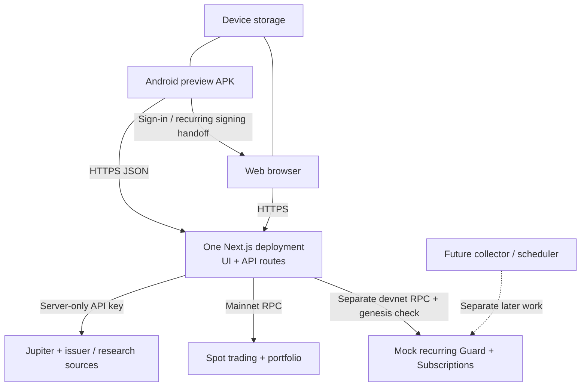

# Zero-cost hackathon deployment plan

Verified against official provider documentation on **16 September 2026**. This is a deployment plan; no service, APK build, paid resource, cron job, or on-chain deployment was created.

## Recommendation

Use **one Next.js deployment for both the website and `/api/*`**, then point the Android APK at its stable public HTTPS origin. A separate mobile backend is unnecessary. Use the provider's included subdomain for the demo; a purchased domain is optional.

**Vercel Hobby is suitable only if this deployment qualifies as personal, noncommercial use.** A hackathon entry does not automatically make a commercial brokerage project eligible. Its current documentation lists a 300-second function maximum, but Kite explicitly caps its long API routes at 60 seconds; keeping those bounds is sensible. Hobby usage is capped and can pause when exhausted. Confirm eligibility before choosing it. [Vercel Hobby](https://vercel.com/docs/plans/hobby)

If that condition is not satisfied, or a conventional Node server is preferred, **Render Free can host a limited demonstration**. It sleeps after 15 minutes without inbound traffic and usually needs about a minute to wake; this can exceed mobile request timeouts. Its 750 free instance-hours are shared across a workspace each month. Files disappear on restart/redeploy/sleep, and free services cannot attach persistent disks. Bandwidth/build quotas also apply: overages can be billed with a payment method, while accounts without one are suspended or prevented from building. Treat it as a preview, not guaranteed uptime for real-money operation. [Render free-service limits](https://render.com/docs/free)

There is no claim here that unlimited traffic, a continuously available worker, real transaction fees, or production brokerage operation can be guaranteed at zero cost.



## What can be demonstrated now

The website, discovery/research, paper portfolio, mobile HTTPS integration, and read-only recurring catalog/config can run on this architecture. Mainnet quotes/trades still depend on valid routes, wallet support, RPC availability, and user-funded network fees.

**Recurring execution remains blocked by the contract integration findings in [the devnet audit](devnet-contract-audit.md).** Deploying the website will not fix those findings. Keep current fail-closed simulation checks and display the actual backend reason. Do not promote mint-authority checks or `readyToPrepare` into a claim that installments execute successfully. No worker is included; `/api/recurring/collect` returns a transaction for signing rather than running a schedule by itself.

## Environment variables

The maintained template is [`apps/web/.env.example`](../apps/web/.env.example). Set values in the hosting dashboard, independently for preview and production. Public values used by Next.js must be present at build time.

| Variables | Purpose and scope |
|---|---|
| `NEXT_PUBLIC_PRIVY_APP_ID` | Optional public Privy app ID; configure allowed website origins and Solana wallets in Privy. No server Privy secret is consumed by the current code. |
| `NEXT_PUBLIC_SOLANA_RPC_URL`, `NEXT_PUBLIC_SOLANA_WS_URL` | Browser-safe mainnet RPC and optional matching WebSocket endpoint. Public/bundled; restrict provider keys appropriately. |
| `SOLANA_RPC_URL` | Server mainnet RPC for portfolio, preparation, simulation, and broadcast. |
| `JUPITER_API_KEY` | Server-only Jupiter key. Kite's trade routes require it even where the provider offers keyless endpoints. |
| `KITE_TRADE_SECRET` | Random server-only HMAC secret, at least 32 characters; use the same value across instances of one deployment. |
| `KITE_RECURRING_RPC_URL` | Separate **devnet** RPC; checked by genesis on recurring reads/preparation/execution. |
| `KITE_RECURRING_AUTH_SECRET` | A different random server-only HMAC secret, at least 32 characters. It is not a wallet key. |
| `KITE_SITE_URL` | Canonical public HTTPS website origin, with no path/query/credentials; set to the stable deployed origin. |
| `KITE_ALLOWED_ORIGINS` | Exact comma-separated browser origins for a separately hosted Expo-web client, if used. Same-origin web and native APK requests need no extra origin entry. Never `*`. |
| `KITE_TRUST_PROXY` | Keep `false` locally; Vercel is detected automatically. Set `true` on a verified proxy that overwrites forwarded protocol/IP headers, such as the configured Render ingress. |
| `KITE_OPERATOR_NAME`, `KITE_SUPPORT_EMAIL` | Accurate public operator identity and support contact in policy pages. |
| `NEXT_PUBLIC_PLAUSIBLE_DOMAIN` | Optional consent-controlled analytics site identifier. Leave empty if not using that service; it is not required for a free demo. |

`PRIVY_APP_SECRET` and `KITE_RECURRING_POOLS` have been removed from the example because current code does not consume them. No CPMM pool mapping, keeper key, swapper key, stock mint-authority key, or collector wallet key is needed by the website. The public devnet mint manifest remains `apps/web/public/xstocks-devnet/xstocks.json`.

Generate secrets privately with a password manager or local cryptographic generator and paste them into the host's secret settings. Do not place them in any `NEXT_PUBLIC_*` or `EXPO_PUBLIC_*` variable, shell transcript, committed file, mobile build setting, or APK. Rotating HMAC secrets invalidates outstanding transaction authorizations, so coordinate rotation across active deployment instances.

## Vercel setup — conditional first choice

Import this repository as a **Next.js** project. Select `apps/web` as Root Directory and include workspace files outside it so `packages/sdk` and the root lockfile are available. Vercel supports monorepo projects, and its CLI must be run from the repository root. [Vercel monorepo configuration](https://vercel.com/docs/monorepos)

| Setting | Value |
|---|---|
| Root Directory | `apps/web` |
| Framework | Next.js |
| Node.js | `24.x`; local/EAS baseline is `24.12.0` |
| Install command | `npx pnpm@10.31.0 install --frozen-lockfile` |
| Build command | `npx pnpm@10.31.0 --filter @kite/sdk build && npx pnpm@10.31.0 --filter @kite/web build` |
| Output directory | Next.js default, no static-export override |

Node 24 is supported for Vercel builds and functions. [Official Node 24 announcement](https://vercel.com/changelog/node-js-24-lts-is-now-generally-available-for-builds-and-functions)

Set the environment values above in the dashboard. Use a public deployment origin for the APK; an authentication-protected preview can return an HTML login page instead of JSON. Do not embed a deployment-protection bypass token in the app. Register that stable origin in Privy and any browser RPC origin restrictions.

Owner-run CLI alternative, from the repository root, after reviewing the project settings:

```bash
npx vercel@latest login
npx vercel@latest link
npx vercel@latest
# After the preview passes the checks below:
npx vercel@latest --prod
```

No background loop should be attached to a request or used to keep a function alive. Return the prepared transaction, let the user sign, and submit through the exact-message authorization endpoint. Keep the scheduler as separate later work.

## Render setup — sleeping preview alternative

Create a **Node Web Service**, not a Static Site: Kite requires server routes. Render officially supports full Next.js as a web service. [Render Next.js deployment](https://render.com/docs/deploy-nextjs-app)

Use repository root as the service root, choose the **Free** instance, set `NODE_VERSION=24.12.0`, and configure:

```bash
# Build command:
npx pnpm@10.31.0 install --frozen-lockfile && npx pnpm@10.31.0 build:sdk && npx pnpm@10.31.0 build:web

# Start command:
npx pnpm@10.31.0 --filter @kite/web exec next start --hostname 0.0.0.0 --port "$PORT"
```

Render accepts a `NODE_VERSION` environment setting. [Render Node version configuration](https://render.com/docs/node-version)

Set `KITE_SITE_URL` to the service's public HTTPS origin and configure trusted proxy handling so HTTPS requests do not loop through redirects. Use `/` for the platform health check; probing `/api/markets` repeatedly spends external-provider quota. Keep the existing application timeout behavior visible to users. A cold start can require reopening/retrying the app once the server wakes; do not hide it by fabricating cached prices. Do not add artificial keep-alive traffic or a scheduler to evade free-service sleep.

## Android preview APK

Expo's Free plan currently includes **15 Android and 15 iOS builds per month**, a low-priority queue, one concurrent build, and a 45-minute build timeout. Reserve builds for tested commits. [Expo pricing](https://expo.dev/pricing) Once the free quota is used, builds stop until the next calendar month unless the account upgrades or builds locally. [Expo billing FAQ](https://docs.expo.dev/billing/faq/)

The existing [`apps/mobile/eas.json`](../apps/mobile/eas.json) `preview` profile already selects internal distribution, the `preview` EAS environment, and Android `buildType: "apk"`. This produces a directly installable APK; an AAB from the production profile is intended for store distribution. [Expo APK instructions](https://docs.expo.dev/build-reference/apk/)

From `apps/mobile`, the owner can link the Expo project and set **public** EAS preview values after the HTTPS backend exists:

```bash
npx eas-cli@latest login
npx eas-cli@latest init
npx eas-cli@latest env:set --name EXPO_PUBLIC_API_BASE_URL --value https://YOUR-KITE-HOST --environment preview --visibility plaintext
npx eas-cli@latest env:set --name EXPO_PUBLIC_WEB_URL --value https://YOUR-KITE-HOST --environment preview --visibility plaintext
npx eas-cli@latest build --platform android --profile preview
```

Use origins only, without `/api`, `/sip`, paths, query strings, or trailing credentials. Both values can be the same Next.js origin. The repository's release validation rejects localhost, private IPs, and HTTP for preview/production builds. Local ignored `.env.local` does not automatically configure remote EAS jobs. EAS variables are environment-scoped, and anything embedded in client code is readable by APK users. [EAS environment variables](https://docs.expo.dev/eas/environment-variables/)

Run EAS from `apps/mobile`, where `eas.json` and the app config live, while retaining the whole workspace for dependency installation. [EAS monorepo instructions](https://docs.expo.dev/build-reference/build-with-monorepos/) Native mobile requests do not normally send an `Origin` header, which the existing API middleware accepts. A separate Expo-web domain does send one and must be added to `KITE_ALLOWED_ORIGINS`. CORS is a browser access rule, not caller authentication: transaction authorization and wallet signatures remain mandatory.

The mobile SIP screen should use the devnet config/plan routes and its supported browser signing handoff. The mainnet native wallet signer is not a devnet recurring signer. Expo's development tunnel only serves the app bundle; it is not a deployed backend and is unsuitable as the APK's permanent API URL.

## Quotas and state boundaries

- **Jupiter:** the current Free API plan lists 1 request/second; keyless access lists 0.5 requests/second. All demo users share the server credential's capacity. Cache public market reads, avoid simultaneous exhaustive basket audits during the demo, and observe rate-limit responses rather than repeatedly refreshing. [Jupiter plans and limits](https://developers.jup.ag/docs/portal/plans)
- **Solana RPC:** public endpoints are rate-limited and expressly not intended for production. The devnet audit already encountered HTTP 429 during sequential mint reads; its batched audit succeeded. A provider's free dedicated allowance can help only within that provider's actual quota. Keep mainnet and devnet URLs separate and never publish a server-only provider key. [Solana public RPC guidance](https://solana.com/docs/references/clusters)
- **Current state:** paper portfolios/preferences are device-local, and live wallet/Guard state is on-chain. Server market caches and request-limit buckets are in memory, so they reset and do not coordinate across serverless instances. They are not durable storage or a globally enforced abuse limit. Keep provider/gateway limits enabled; add distributed rate limiting and persistent worker receipts if the later operating model requires them.
- **No database is required for this bounded preview.** Do not introduce free-tier databases only to mirror on-chain state. Any future server-side jobs/receipts must use durable storage rather than function memory or an ephemeral host filesystem.
- **No free trading guarantee:** hosting and APK build allowances do not pay Solana fees, account rent, third-party paid plans, or exchange fees. Missing quotes, unsupported wallets, illiquid baskets, and recurring contract errors must remain visible and block the affected action.

## Owner-run verification before sharing

From repository root:

```bash
npx pnpm@10.31.0 install --frozen-lockfile
npx pnpm@10.31.0 build:sdk
npx pnpm@10.31.0 typecheck
node --test apps/web/tests/*.test.mjs
node --test apps/mobile/tests/*.test.cjs
npx pnpm@10.31.0 build:web
node scripts/check-client-secrets.mjs
node scripts/audit-devnet-recurring.mjs
```

These commands are verification instructions; this document does not claim the entire release suite or an APK build was run. The secret scanner compares built browser artifacts against privately configured server secrets; it intentionally fails if there are no configured comparison values or no build output. Load the intended deployment environment locally without printing it before scanning. Pass an exported mobile artifact directory as an additional argument when checking mobile bundles. Contract runtime gaps are recorded separately in the audit.

After deployment, replace `YOUR-KITE-HOST` and run these read-only or invalid-request checks:

```bash
curl -sSI https://YOUR-KITE-HOST/
curl -sS https://YOUR-KITE-HOST/api/recurring/config
curl -sS -D /tmp/kite-market-headers.txt -o /tmp/kite-markets.json https://YOUR-KITE-HOST/api/markets
curl -si -H 'Origin: https://unapproved.example' https://YOUR-KITE-HOST/api/markets
curl -si -X POST -H 'Content-Type: application/json' --data '{}' https://YOUR-KITE-HOST/api/recurring
```

Expect HTTPS without redirect loops; public HTML rather than a deployment-login screen; JSON API responses; `network: "devnet"` in recurring config and `network: "mainnet-beta"` in market data; HTTP 403 for the unapproved browser origin; and HTTP 422 for an invalid recurring request. Market-provider outages may legitimately return 503 with unavailable data, which is not a successful live-data smoke check. Test light/dark pages and APK access over mobile data, then check browser sign-in/handoff return behavior. A read-only authority pass is not a successful recurring collection test.

Record the deployed Git SHA, production URL, APK build ID, and last passing checks. Keep the previous working deployment/APK available for rollback. Do not share a stale APK after changing its embedded backend origin. Recurring execution and any future cron remain explicitly gated on resolving the contract audit and completing a separate wallet-approved devnet end-to-end run.
