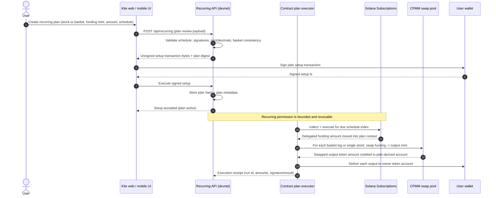
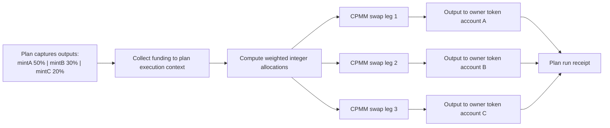
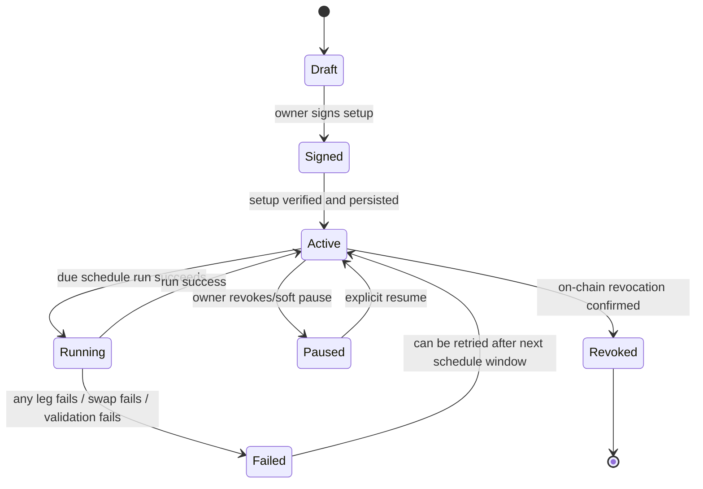

# Recurring investing on devnet (CPMM + contract execution)

> Historical design: main was changed to a devnet subscription + mock-mint demonstration in `1048632`. This CPMM document is retained as design history, not current setup instructions. See [the current protocol](kite-guard-protocol.md) and [execution blockers](devnet-contract-audit.md).

This document captures the currently implemented devnet recurring model that uses a dedicated contract execution path for plan-driven basket and stock investments.

## What is implemented

- Recurring plans are created from the web API and stored as deterministic plan records.
- Funding withdrawals and swaps are executed in one on-chain contract flow.
- Plan execution can deliver either a single stock or a basket by splitting one funded amount across multiple swap legs.
- The implementation is currently designed and tested for **devnet only** and uses a scripted devnet xStock catalog and liquidity pools.

## Components

- Web UI: plan form, schedule builder, availability checks, and transaction approval.
- Recurring API: prepares plan instructions, validates the plan, and exposes readiness/health.
- Contract: executes the collect-and-swap cycle through CPMM swaps after permissioned funding is moved into the plan context.
- Runtime/SDK: shared schedule math, plan validation, deterministic allocations, and transaction builders.

## Devnet recurring runtime flow

## Baskets, stocks, and allocation model

The basket execution path does not mint synthetic basket tokens.

1. A plan stores immutable output mints and weights in basis points.
2. The contract computes exact integer allocations for each output on every run.
3. Legs are executed independently by CPMM swap CPI in a single plan execution.
4. Output amounts are validated against configured minimums before finalizing.

## State transitions

## Core checks performed in the devnet flow

- plan has finite schedule and bounded lifetime (no infinite plans)
- schedule index can only be run once per period
- no period catch-up accumulation
- funding token and output mints must be known and non-extended
- required authority roles are explicit and verified before execution
- minimum output and slippage safety checks are enforced per leg
- replay protection uses on-chain execution counters

## Known limits at the devnet stage

- Program IDs, pool mapping, and funding catalog are devnet-specific.
- Some devnet xStock mints are scripted and not fully liquidity-tested for long-duration production behavior.
- Mainnet wallet behavior, fees, and pool depth can differ materially from devnet.

## Why this is separate from legacy path

This is a contract-assisted route where swap execution is enforced by the plan program for the devnet model. The current product-wide recurring API also includes a legacy delegated-payment flow; the devnet contract path is the newer atomic-execution path and is intended for the staged migration path described below.

