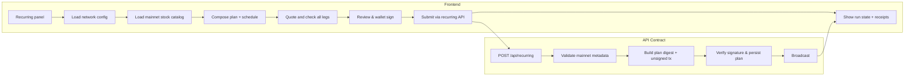
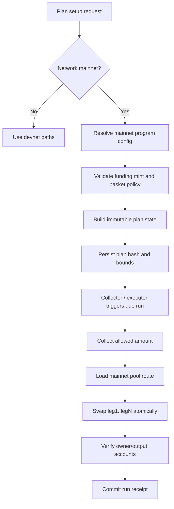
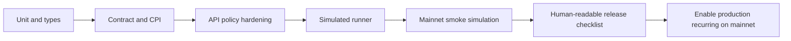

# Moving recurring from devnet CPMM model to real mainnet xStocks / baskets

This doc describes the frontend, smart contract, and test changes required before we can claim mainnet readiness for recurring investing with real tokenized stocks.

The goal is:

- real mainnet xStock pre-defined tickers,
- real mainnet basket compositions,
- real mainnet funding tokens (for example USDC/USDT-like USDP style assets),
- atomic recurring execution behavior consistent with the current devnet intent,
- and clearly measurable readiness checks.

## Frontend implementation for mainnet

Frontend work should be done in two layers: plan UI and execution controls.

### Plan UI changes

1. **Cluster-aware catalog loading**
   - Add explicit `cluster` mode for recurring configuration (`devnet`, `mainnet`).
   - On mainnet, read only mainnet xStocks and baskets from a signed mainnet catalog manifest.
   - Hide devnet-only tokens and fake symbols in mainnet UI.

2. **Funding token and route UX**
   - Replace assumptions of devnet stable funding with a real mainnet supported list.
   - Show funding-token decimals and expected fees at all review steps.
   - Reject unsupported token extensions with explicit copy before submit.
   - Refresh quotes and route feasibility in the same review window as plan creation.

3. **Schedule + execution policy disclosure**
   - Keep fixed-interval authorization window and explicit skip-on-miss behavior.
   - Surface "on-chain execution cap vs user calendar intent" difference.
   - Add a hard boundary warning that permission is bounded but buyer/collector trust and identity is outside contract logic unless delivery enforcement is in place.

4. **Plan lifecycle and receipts**
- show `Active / Paused / Revoked / Expired / Failed` clearly,
- display next due schedule and skipped periods,
- persist run payload hash in local storage or backend cache until settled,
- allow resume/retry only for due run and only with the same signed payload.

5. **Wallet gates**
   - Enforce V1 transaction capability and mainnet cluster signing on submit.
   - Reject unsupported signers before prepare.

## Smart contract and on-chain model changes for mainnet

Current devnet design assumptions that must be removed/parametrized:

- fixed devnet program IDs in code and fixtures,
- hardcoded pool map entries for scripted mints,
- fixed funding token assumptions,
- devnet genesis guard and script-only manifest assumptions.

### Mainnet contract changes

1. **Cluster configuration**
   - Introduce network-aware config (`devnet` vs `mainnet`) with separate program IDs and token policy files.
   - Keep compile-time constants for safety only; move all mutable IDs to runtime config.

2. **Token policy**
   - Use allowlist by mint + policy flags (`supported`, `frozen`, `hasTransferHook`, decimals bounds).
- For baskets, store output mints and weights in immutable plan state at creation.
   - Validate every output mint from a controlled catalog at creation time.

3. **CPMM routing on mainnet**
   - Replace devnet swap pool assumptions with a real mainnet pool resolver layer.
   - Add a route fallback strategy when a configured pool is temporarily unavailable.
   - Keep exact integer allocation; reject partial plans when one leg cannot safely execute.

4. **Funding and spend controls**
   - Remove assumptions around scripted devnet funding mint and funding decimals.
   - Accept real funding tokens through configurable metadata (`symbol`, decimals, freeze flags).
   - Enforce minimum output per leg and cumulative exposure checks using onchain account deltas.

5. **Execution hardening**
   - Keep replay protection via schedule index + execution counter.
   - Ensure missed-period behavior is deterministic (skip, do not auto-compound).
   - Keep revocation behavior independent of UI state and make on-chain revocation final after confirmation.

6. **Operational safety**
   - Add explicit emergency pause mode usable by deployer/operator only.
   - Make failure modes explicit in state logs (oracle unavailable, route missing, insufficient liquidity, CPI failure).
   - Emit concise event fields for run id, leg index, amount-in, amount-out, and status.

## Test changes for mainnet readiness

To prove mainnet readiness, tests should explicitly split by cluster and execution path.

### 1. Unit-level updates

- Add a new `mainnet` test group for all schedule math and plan constraints with real-world basket examples.
- Include fixtures for real token decimals and basket weights.
- Add deterministic snapshots for plan digest generation on each supported runtime.

### 2. Contract/instruction tests

- Add integration tests that sign and simulate real-mainnet-like execution instructions against pinned program definitions.
- Validate that:
  - basket and stock plans both execute via CPI with same counter discipline,
  - failed legs revert the full run outcome,
  - revoked plans cannot execute,
  - skip-on-miss logic is deterministic.
- Add negative tests for unsupported mints (transfer hooks, wrong owner, non-standard extensions).

### 3. End-to-end API/runner tests

- Mocked RPC + local fixtures:
  - config endpoint exposes correct reasons for unprovisioned/invalid pools,
  - `/api/recurring` rejects unsupported mainnet states before creating any signature,
  - `/api/recurring/execute` replays old signatures only when intent and block-height constraints are valid,
  - collection with changed route hashes is rejected.

### 4. Real-network readiness checks

- Add smoke tests that hit a dedicated mainnet endpoint for:
  - account decoding of a real basket execution account,
  - route parse / instruction assembly for at least one stock + one basket,
  - successful simulation for a known-good path.

### 5. Regression matrix before release

## Deployment and operation notes

- Keep a separate devnet and mainnet environment configuration.
- Keep executor identity and HSM/storage policies separate per cluster.
- Require explicit operator sign-off before switching the front-end default from devnet to mainnet recurring.
- Preserve existing visibility of legacy payment-only recurring path during migration.
- Treat this migration as a versioned feature flag with rollback to legacy mode if any invariant in receipts/execution diverges.

## Acceptance checklist (must be true before claiming mainnet ready)

-  Real mainnet xStock list loads in `mainnet` mode and does not include devnet mints.
-  Basket weights are immutable per plan and visible in UI review.
-  No hardcoded devnet IDs remain in runtime execution path.
-  Missed periods never accumulate into catch-up buy orders.
-  Revocation blocks future runs onchain, even if UI state is stale.
-  One end-to-end smoke path runs successfully in a mainnet simulation environment and one failure path is proven (leg failure rollback).
-  Public test evidence includes both single-stock and basket recurring receipts.

