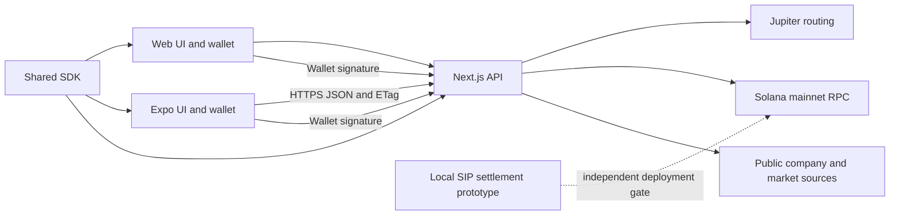

# Kite SDK architecture and implementation boundaries

Updated 13 September 2026. This document distinguishes code that exists from capabilities that still need runtime integration and deployment validation. Neither a roadmap nor a passing unit test establishes mainnet readiness or legal compliance.

## System ownership

`packages/sdk` owns market and research types, real data normalization, precision math, paper orders, basket allocation and shared networking/state primitives. Web and mobile consume the same modules. The Next.js API is the server boundary for private provider credentials, quote authorization, wallet verification and broadcasting. Expo receives only a public HTTPS API origin and public wallet app configuration.

Paper orders are explicitly virtual and use real available market observations. They never borrow an underlying exchange share price as the token's executable price. Missing or stale provider data remains unavailable rather than receiving invented values. Research is sourced from public company, financial and news data; it is not described as AI-generated fundamentals.

Actual single-asset swaps are constructed through Jupiter, signed by the user's connected wallet, and submitted through the server. A transport timeout after submission is an unknown outcome; it must not prompt an automatic retry. Mainnet routes do not depend on a Kite vault or receipt token.

## Current protocol constraints

Solana's official upgrade page reports V1 mainnet activation as pending at epoch 1035, expected 15 September 2026 at approximately 01:20 UTC. It lists the `txv1` feature gate and explains that V1 requires compatible serializers and wallets. The installed web3.js v1 client does not build V1 transactions. Until actual feature, RPC, library and wallet support are all verified, Kite builds supported **v0 transactions with the 1,232-byte limit**, using existing lookup tables where provided. A future activation date is not a capability check. [Solana upgrade status](https://solana.com/upgrades/larger-transaction-sizes), [transaction documentation](https://solana.com/docs/core/transactions).

`basket/atomic-swap.ts` provides deterministic integer allocation and a v0 instruction composer. It rejects oversized transactions, excess accounts, missing legs, additional signers and duplicate per-leg compute budgets. It never silently splits a basket into independently committed transactions. Route discovery, route-economic validation, available lookup tables and simulation are required before this composer can be used for actual multi-asset orders. A seven-stock basket is not guaranteed to fit.

## Delegated SIP: implemented primitive, not a deployed service

The old Anchor prototype minted arbitrary receipt tokens without collecting input and logged SIP execution without transferring assets. Those instructions and obsolete tests have been removed. Its replacement has no token vault, receipt mint or pooled balance.

The new local program creates an owner-authorized plan with a finite SPL allowance, fixed installment, minimum output, interval, expiry and maximum cycle count. An executor supplies inventory from its own token account. The program atomically transfers output to the owner's pinned account and the installment to the executor. Only the plan PDA can spend its allowance, and it can only do so while satisfying the plan. Owner cancellation revokes the allowance. Independent SPL revocation also stops execution. Completed or cancelled plan IDs remain tombstones to prevent reinitialization.

This is **inventory-backed settlement at a signed output floor**, not permissionless best-execution Jupiter DCA. A fixed floor can become economically stale. A production service needs a reviewed pricing policy, route adapter and crank operations. The current program accepts legacy SPL Token accounts only; Token-2022 extensions and native SOL are not silently supported. The SDK requires callers to supply an explicit program ID; no default mainnet identity or frontend activation is provided.

`subscriptions/delegation.ts` builds creation/cancellation and verifies live owner/mint/delegate allowance. `subscriptions/crank.ts` builds the direct settlement transaction. See [program usage](../packages/anchor/README.md) and [security evidence](protocol-security.md).

## SDK implementation map

| Module                              | Responsibility                                                 | Boundary                                                                   |
| ----------------------------------- | -------------------------------------------------------------- | -------------------------------------------------------------------------- |
| `markets.ts`, `mint-precision.ts`   | Issuer catalog, provider observations, exact token precision   | Missing metadata fails closed for actual orders                            |
| `research.ts`, `research-client.ts` | Sourced research and deduplicated cache                        | Availability and source timestamps remain visible                          |
| `paper.ts`                          | Virtual orders, asset swaps, baskets and scheduled demo cycles | No actual wallet execution                                                 |
| `client/`                           | Typed, shared web/mobile API transport                         | Same server authentication and outcome rules                               |
| Shared state core                   | Cross-platform storage and paper/watchlist state               | Platform adapters handle storage and lifecycle                             |
| `subscriptions/`                    | Finite allowance and local settlement builders                 | Not connected to a deployed SIP program                                    |
| `basket/atomic-swap.ts`             | Integer allocation and v0 composition                          | Validated route instructions required; oversized baskets reject            |
| `simulation.ts`                     | Read-only preflight of unsigned wallet quotes                  | Passed, failed and unavailable remain distinct                             |
| `pyth-streaming.ts`                 | Hermes SSE, staleness, confidence and ordering guards          | Native caller supplies EventSource adapter; feed identity must be verified |
| `rebalance.ts`                      | Integer USD-micro drift proposals and cash-flow-bounded TWR    | Does not fabricate token quantities, quotes or performance history         |

Simulation checks the expected taker, supported transaction size and required signer, then runs the exact transaction without replacing its blockhash or requiring the not-yet-present taker signature. A sponsored transaction's existing signatures are preserved. A successful observation cannot eliminate future failures or fees; state may change before execution.

The Pyth stream is a utility, not a replacement for issuer/Jupiter token prices. It only accepts requested feed IDs and fresh, ordered, confidence-bounded updates. Market-open status is not inferred from receiving an oracle tick. Native runtimes must supply an SSE implementation rather than importing browser globals at startup. [Pyth Hermes documentation](https://docs.pyth.network/price-feeds/core/fetch-price-updates).

Rebalancing requires real, consistently timestamped valuations. Drift calculations preserve integer units and explicitly include available cash. Time-weighted returns require valuations immediately around external flows. Money-weighted returns and benchmark correlation remain unimplemented until there is sufficient dated flow and valuation history; the UI must not invent those values.

## Web, mobile and deployment

Both clients use the deployed web API. A development tunnel must expose the Next.js origin separately from the Expo Metro tunnel. An APK cannot reach the developer laptop through its own `localhost`. Release builds require a stable public HTTPS origin; CORS policy applies to browser/Expo web origins and should allow configured origins, not arbitrary credentialed websites. Native HTTP clients are not governed by browser CORS.

Public configuration may include `EXPO_PUBLIC_API_BASE_URL` and public Privy app/client identifiers. Jupiter keys, RPC provider secrets, Privy app secrets and trade authorization secrets remain server-only. Do not put deployment-protection bypass credentials into an APK. HTML auth redirects must be reported as API configuration errors, not parsed as JSON or allowed to blank the app.

Deployment protection, function duration and cache behavior depend on the configured hosting project and plan. Verify actual settings instead of assuming a universal 15-second limit or sub-25ms responses. Public market caches must distinguish completed data from in-progress snapshots; never cache authenticated portfolios, quotes or execution responses publicly. Process-local caches reduce warm latency but do not guarantee cache continuity across functions or regions.

Native Android external-wallet execution uses MWA. Privy remains available through the web sign-in flow; native Privy embedded-wallet parity is not implemented by this change. Future Privy web and native identity parity requires the same correctly configured Privy application and account linkage. Do not assume that a wallet name, social account or public app ID alone establishes parity. MWA authorization must be saved securely and reauthorized when available. Real signing, app switching, rejected signatures and uncertain execution outcomes need physical-device tests before release.

## Verification and outstanding deployment gates

The implementation records SDK tests, five passing Rust host tests, a successful SBF compilation and five passing local-validator integration cases in [protocol security evidence](protocol-security.md). Issuer mainnet-account compatibility, route integration and independent adversarial review remain deployment gates. Native actual trading needs a custom development build, a real wallet and an HTTPS API. No contract deployment or real trade is authorized merely by building this repository.

Before enabling actual automated SIP or multi-leg basket routing: validate the complete composed transaction against live routes, retain explicit user limits, run adversarial/fuzz tests, obtain independent program review, choose an upgrade-authority policy and verify any newly activated transaction version end to end. Plain SPL delegation is an allowance primitive; it does not by itself establish regulatory compliance or best execution.

## Release and rollback guide

See [deployment and launch verification](deployment-readiness.md) for environment setup, HTTPS API tunnels, APK/AAB profiles, security checks and the ordered commit groups. The deployment operator, support contact and production analytics domain are configuration values; this pull request does not invent those details or activate an analytics account.
