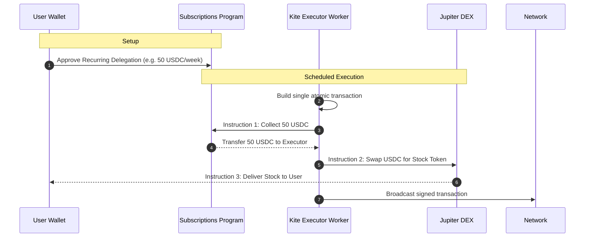
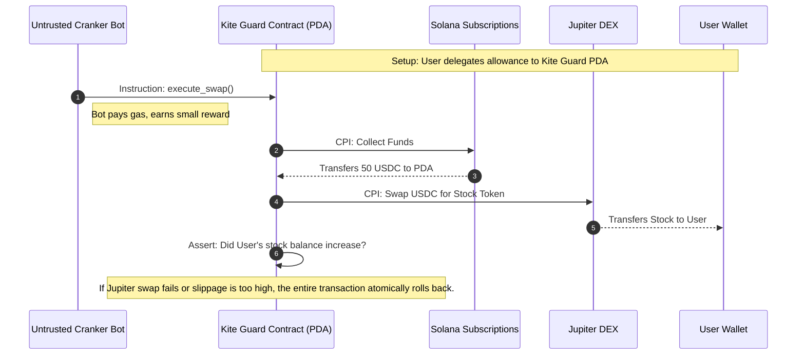

# Architecture & V2 Roadmap

Kite is currently transitioning from a UI-layer Neo-Brokerage into a fully on-chain composable DeFi protocol. This document outlines the current state of recurring investments on Kite (Phase 1) and the technical roadmap for the future (Phase 2).

---

## Phase 1 (Current): Subscriptions & Allowances

Kite currently leverages the official **Solana Subscriptions & Allowances** program (`@solana/subscriptions`) to power non-custodial recurring investments. 

### The Non-Custodial Delegation Model
Instead of locking user funds into a smart contract vault (which fragments liquidity), Kite uses the program's native capability to set a recurring allowance:
- **Funds stay in the wallet**: The user retains full control of their tokens.
- **Time-bounded allowances**: The user signs a transaction granting the Subscriptions Program PDA the authority to withdraw a strict maximum amount per period (e.g., 50 USDC per week).

### The Trust Boundary (The Off-Chain Cranker)
The Subscriptions program only *permits* a withdrawal; it does not automatically *push* the payment. Therefore, Kite operates an off-chain Node.js worker ("cranker") that acts as the authorized delegate. 

When a period comes due, the Kite worker builds a single atomic transaction that batches the withdrawal with a Jupiter Swap to ensure the user gets their stock immediately.

**The Vulnerability:** The Solana Subscriptions program enforces the billing limit perfectly, but it relies on the Kite worker being honest about executing the Jupiter swap. A compromised worker could omit the swap and pocket the funds. The current UI explicitly discloses this boundary to the user.

---

## Phase 2 Roadmap: Trustless Execution Guard

To remove the trusted off-chain worker, Kite will deploy a lightweight **Execution Guard** Anchor smart contract. 

Instead of delegating the allowance to a backend worker, the user will delegate to the custom contract's PDA. An untrusted decentralized cranker network (e.g., Clockwork) can ping the contract, which then performs all logic securely on-chain via **Cross-Program Invocations (CPI)**.

This guarantees **100% trustless execution** while maintaining the benefits of the non-custodial subscriptions model.

---

## Phase 2 Roadmap: Composable Brokerage Primitives

Beyond trustless execution, custom smart contracts will allow Kite to offer advanced primitives native to Solana.

### 1. On-Chain Basket Mints (True Tokenized ETFs)
Currently, buying the `SOL-MAG7` thematic basket executes multiple Jupiter swaps and deposits 7 individual tokens into the user's wallet. 

In V2, a **Basket Vault Program** will execute the swaps, hold the underlying stocks in a vault, and mint a single **`kMAG7` SPL Token** back to the user. This `kMAG7` token becomes a fully composable asset that users can trade or use as collateral in lending protocols (e.g., Kamino, Marginfi).

### 2. Trustless Portfolio Rebalancing
With the Basket Vault in place, Kite can offer fully autonomous, self-balancing index funds. 
- The contract stores the target weights of the index.
- If weights drift (checked via native **Pyth Network** on-chain oracle CPIs), *any cranker bot* can call a `rebalance()` instruction.
- The contract automatically uses Jupiter to sell over-weight assets and buy under-weight assets.

### 3. Decentralized Limit Orders & Stop Losses
An **Orderbook Program** will allow users to place advanced orders natively on-chain.
- A user delegates funds with a condition: *"Only buy TSLA if Pyth reports price < $200."*
- When the condition is met, a cranker executes the swap trustlessly for a small bounty.

### 4. Protocol Revenue & Fee Routing
Every time a user interacts with a Kite contract, the contract will atomically route a tiny protocol fee (e.g., 0.1%) to the Kite DAO Treasury, creating transparent, mathematically guaranteed revenue generation.
