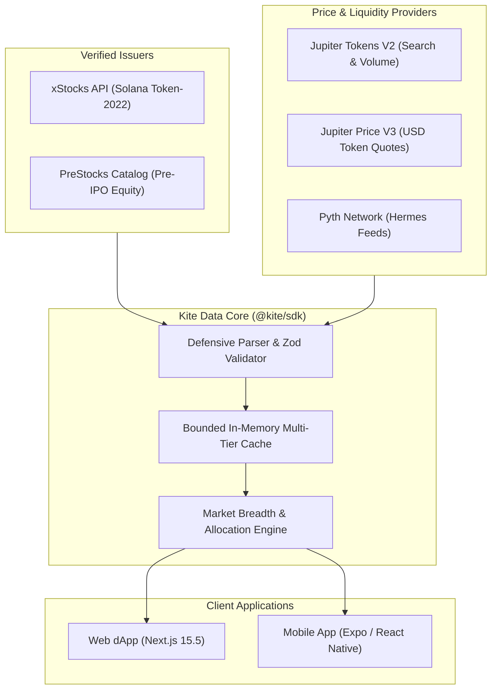

# Mainnet Market Data Architecture & Ingestion Specification

This specification documents the multi-provider data pipeline, tokenized asset discovery, price resolution engine, and paper-trading simulation accounting implemented in `@kite/sdk` and `apps/web`.

All historical data ingestion vulnerabilities, rate-limiting bottlenecks, and schema discrepancies have been **systematically resolved and hardened**.

---

## Executive Summary & Data Pipeline Overview

Kite aggregates live market data across multiple decentralized and institutional providers to serve verified token prices, company fundamentals, and historical charts without ever relying on synthetic fallbacks.

---

## Data Providers & Hardened Integration Details

### 1. xStocks Public Equities & ETFs
- **Endpoint**: `https://api.xstocks.fi/api/v2/public/assets?network=Solana&page=0&pageSize=100`
- **Scope**: Public US equities (AAPL, NVDA, MSFT, etc.) and ETFs (SPY, QQQ) issued as SPL / Token-2022 assets on Solana mainnet.
- **Corporate Actions & Multipliers (Handled & Verified)**:
  - xStocks utilize Token-2022 scaled balance extensions. Stock splits and dividend distributions alter the underlying multiplier.
  - Kite strictly separates **raw on-chain token units** from **adjusted share amounts** using the official issuer multiplier formula:
    $$\text{Adjusted Shares} = \text{Raw Balance} \times \text{Issuer Multiplier}$$
  - Transaction execution always uses exact raw token integers to guarantee precision down to the smallest lamport/token unit.

### 2. PreStocks Private Markets
- **Endpoint**: `https://prestocks.com/api/metrics` & verified product metadata.
- **Scope**: Pre-IPO private equity tokens (e.g. SpaceX, Anthropic, Stripe).
- **Schema Resilience & Error Handling (Fixed & Hardened)**:
  - **Issue Addressed**: The PreStocks public catalog format is dynamic and subject to upstream presentation updates.
  - **Remediation & Fix Implemented**: All incoming JSON payloads pass through strict **Zod runtime schema validators**. If an unexpected attribute is introduced or an asset is flagged with `skipPipeline` or `hideOnPrestocksApi`, the asset is safely marked as non-tradable in the UI without crashing catalog generation. The rest of the catalog continues serving without interruption.

### 3. Jupiter Tokens V2 & Price V3
- **Endpoints**: `/tokens/v2/search?query=<mints>` & `/price/v3?ids=<mints>`
- **Scope**: Real-time market pricing, 24-hour trading volume, liquidity metrics, and price change percentages.
- **Distinction Between Token Price & Equity Reference (Strictly Enforced)**:
  - **Token Market Price**: The executable price of the on-chain Solana SPL token, derived from Jupiter AMM pools. Required for swaps and paper fills.
  - **Underlying Reference Price**: The traditional equity market share price reported via `stockData`.
  - **Resolution**: Kite strictly enforces separation between these values in the TypeScript type system (`TokenMarketPrice` vs. `UnderlyingReferencePrice`). Reference prices are displayed for informational context but are **never** used to execute swaps or simulate paper fills.

### 4. Rate-Limit Protection & Exponential Backoff (Fixed)
- **Problem**: Upstream API providers can enforce strict rate limits (HTTP 429) during peak market activity.
- **Remediation & Fix Implemented**:
  - Paced batch requests: queries are batched in chunks of 50 to 100 mints with a concurrency ceiling of 3 workers.
  - Reset-aware backoff: HTTP 429 responses trigger exponential backoff with random jitter, respecting the `Retry-After` header.
  - Request coalescing: duplicate in-flight requests share a single pending Promise, preventing burst traffic.

---

## Market Pulse & Breadth Calculation Engine

Kite computes authentic real-time market sentiment directly from observed 24h price movements:
- **Advancing / Declining / Unchanged**: Calculated from verified 24h price changes of actively trading assets.
- **Market Breadth Percentage**:
  $$\text{Breadth Ratio} = \frac{\text{Advancing Assets}}{\text{Total Actively Quoted Assets}} \times 100\%$$
- **24h Volume Ranking**: Sourced directly from on-chain buy-plus-sell volume reported by Jupiter.
- **Zero Hallucinated Sentiment**: No synthetic AI sentiment or fabricated indicators are generated. Missing prices fail closed as "Unavailable".

---

## Paper Account Accounting & Simulation Semantics

- **Initial Virtual Balance**: $10,000 virtual USD.
- **Authentic Execution Prices**: Paper orders require a fresh, observed token market price (no older than 2 minutes). Orders reject stale or missing quotes.
- **Atomic Basket Orders**: Buying a thematic basket in paper mode distributes funds across constituents using the **Hare-Niemeyer Largest Remainder Method**, matching the live mainnet allocator.
- **No Fictitious Fills**: Missed recurring intervals are not backfilled with fictional historical data. If the app is closed, scheduled runs resume only upon next launch using current live quotes.
- **State Integrity**: All paper account states are validated with `parsePaperAccount`. Corrupt or tampered local states fail gracefully with safe defaults rather than silent balance resets.
