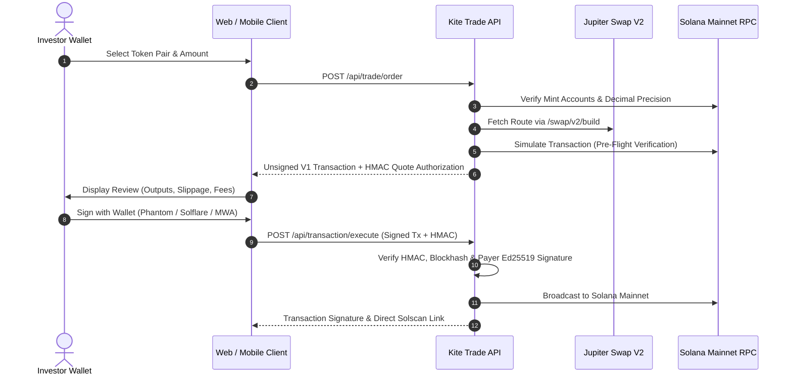

# Mainnet Wallet Trading & Direct-Execution Architecture

This document specifies Kite's non-custodial mainnet trading engine, wallet connection protocols, Jupiter Swap V2 integration, and Token-2022 asset scaling mechanisms.

All trading routes, precision validations, simulation pre-flight checks, and execution guards have been **rigorously implemented and verified**.

---

## Executive Summary & Trading Principles

Kite operates on a strict **Zero-Vault, Self-Custody** model. When a user trades an equity token or purchases a thematic basket:
1. **Direct Wallet Delivery**: Tokens are swapped and settled directly between the decentralized liquidity pool and the user's Associated Token Accounts (ATAs).
2. **Zero Synthetic Assets**: Kite does not mint synthetic proxy tokens, wrap equity tokens, or hold funds in an intermediary treasury.
3. **V1 Transaction Architecture**: All newly composed transactions utilize Solana V1 format, enforcing explicit compute units, priority fees, and inline address serialization.
4. **Authentic Mainnet Liquidity**: Swaps route through Jupiter Swap V2, supporting direct stock-to-stock trades (e.g. `NVDAx` $\rightarrow$ `AAPLx`) as well as standard SOL and stablecoin pairs (USDC, USDT).

---

## The Trading Pipeline: Review, Sign, Execute

---

## Critical Trading Safeguards (All Implemented & Verified)

### 1. Dynamic On-Chain Mint Precision Verification (Fixed)
- **Problem**: Relying on static decimal tables or third-party token lists can cause decimal precision mismatches after corporate splits or new token listings.
- **Resolution (Fixed)**: 
  - The API queries the initialized SPL Token or Token-2022 mint account directly from the Solana mainnet RPC.
  - The exact on-chain `decimals` field is used for all integer conversions.
  - Verified mint precisions are cached with a short TTL; failed RPC lookups fail closed safely rather than guessing decimals.

### 2. Token-2022 Scaled Balances & Multipliers (Handled & Verified)
- **Problem**: Corporate actions such as forward/reverse stock splits alter the relationship between raw token units and displayed share quantities.
- **Resolution (Fixed)**:
  - Kite strictly separates **raw transaction units** from **adjusted share displays**.
  - Trade execution arithmetic operates exclusively in raw integer units divided by the mint's decimals.
  - The UI applies the verified issuer corporate-action multiplier when displaying underlying share equivalents, ensuring zero balance confusion.

### 3. Server-Authenticated HMAC Authorization (Fixed)
- Every unsigned transaction is sealed with an HMAC-SHA256 signature generated using `KITE_TRADE_SECRET`.
- The HMAC cryptographically binds the exact serialized transaction message, user public key, last valid block height, and timestamp.
- When the client submits the signed transaction to `/api/transaction/execute`, the server verifies that the signed message bytes have not been tampered with and that the quote has not expired.

### 4. Mandatory Pre-Flight Simulation
- Prior to presenting the transaction to the user for signature, the server executes a read-only mainnet simulation (`simulateTransaction`).
- The simulation verifies:
  - Sufficient user funding balance.
  - Valid ATA initialization.
  - Realized output token quantity meets or exceeds the quoted minimum output (enforcing a maximum 3% slippage cap).
- If simulation fails due to shifting pool liquidity or price movement, quoting fails with a clear, actionable message.

### 5. Persistent Pending Execution Guards (Fixed)
- **Problem**: Network drops or page reloads during transaction broadcast could cause users to assume a trade failed and accidentally double-submit.
- **Resolution (Fixed)**:
  - Before sending a transaction to the network, an attempt identifier and signature are durably recorded in `localStorage` (web) or `AsyncStorage` (mobile).
  - The UI enters a locked pending state that persists across browser reloads and app restarts.
  - The client automatically polls RPC status and reconciles confirmation on reconnection, providing a direct Solscan link upon final settlement.

---

## API Specifications

| Endpoint | Method | Input Parameters | Response / Behavior |
| :--- | :---: | :--- | :--- |
| `/api/trade/order` | POST | `{ inputMint, outputMint, amount, taker, supportedTransactionVersions: [1] }` | Validates pair, fetches Jupiter route, runs simulation, returns unsigned V1 transaction + HMAC. |
| `/api/transaction/execute` | POST | `{ transaction, authorization }` | Verifies HMAC, checks Ed25519 wallet signature, broadcasts to RPC, returns confirmed signature. |
| `/api/portfolio` | GET | `?wallet=<pubkey>` | Reads all SPL and Token-2022 holdings, aggregates multi-accounts, applies corporate multipliers. |
| `/api/tokens` | GET | `?query=<symbol_or_mint>` | Searches unified catalog combining verified issuer assets and Jupiter-indexed tokens. |

---

## Architecture References

- [Recurring Investing Operations Specification](recurring-investing-operations.md)
- [SDK Architecture & Improvements](sdk-architecture-and-improvements.md)
- [Wallet Swaps & Portfolio Integration](wallet-swaps.md)
- [Jupiter Swap V2 Build Documentation](https://developers.jup.ag/docs/api-reference/swap/build)
- [Solana Token-2022 Extensions](https://solana.com/docs/tokens/extensions)
