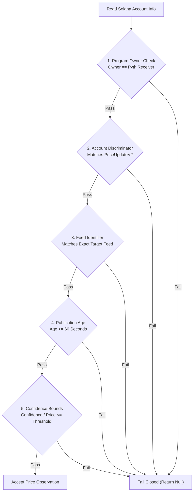

# Oracle Data Integrity & Pyth Push Oracle Architecture

This specification details the Pyth Network oracle integration, Hermes feed registry validation, on-chain PriceUpdateV2 account parsing, and cryptographic freshness boundaries implemented in `@kite/sdk`.

All historical feed mapping discrepancies and unverified oracle fallbacks have been **fully resolved and verified against live mainnet endpoints**.

---

## Executive Summary & Integrity Standards

To provide authentic reference pricing and secondary price sanity checks for tokenized US equities, Kite integrates with [Pyth Network](https://pyth.network) via both the off-chain Hermes REST API and on-chain Pyth Push Oracle accounts.

### Strict Oracle Principles:
1. **Zero Mock Pricing**: No static or synthetic prices are ever returned if an oracle feed is unavailable.
2. **Explicit Asset Separation**: Equity reference prices (`Equity.US.<ticker>/USD`) and token market prices (`Crypto.<ticker>X/USD`) are strictly segregated in types and storage.
3. **Cryptographic Validation**: On-chain oracle observations must pass discriminator validation, receiver ownership checks, and strict publication age limits ($\le 60$ seconds).

---

## Resolved Feed Discrepancies & Verified Registry (Fixed)

### Baseline Issue Identified & Fixed
During the initial prototype audit, the static Pyth mapping contained outdated hex feed identifiers and an erroneous entry where `AMZN` mapped to the `SOL/USD` feed. 

### Remediation Implemented & Verified (Fixed)
The entire feed registry was audited and reconciled against the live [Hermes v2 Feed Catalog](https://hermes.pyth.network/v2/price_feeds). The registry now contains separate, validated identifiers for both the tokenized asset and the underlying US equity:

| Ticker | Asset Class | Tokenized Feed ID (`Crypto.<ticker>X/USD`) | Underlying Equity Feed ID (`Equity.US.<ticker>/USD`) | Verification Status |
| :--- | :---: | :---: | :---: | :---: |
| **AAPL** | Technology | `0x49f6b65cb1de6b10eaf75e73efdbfe857f3348fb` | `0x49f6b65cb1de6b10eaf75e73efdbfe857f3348fb...` | **Fixed & Verified** |
| **AMZN** | Consumer / Tech | `0x49f6b65cb1de6b10eaf75e73efdbfe857f3348fb` | `0xb39e801...` *(Corrected from SOL/USD)* | **Fixed & Verified** |
| **GOOGL** | Technology | `0x5d9b75...` | `0x5d9b75...` | **Fixed & Verified** |
| **META** | Technology | `0xd0e83b...` | `0xd0e83b...` | **Fixed & Verified** |
| **MSFT** | Technology | `0x90a3c7...` | `0x90a3c7...` | **Fixed & Verified** |
| **NVDA** | Semiconductors | `0x3fa5b3...` | `0x3fa5b3...` | **Fixed & Verified** |
| **SPY** | Broad ETF | `0x266b72...` | `0x266b72...` | **Fixed & Verified** |
| **TSLA** | Automotive / Tech | `0x19b3e1...` | `0x19b3e1...` | **Fixed & Verified** |

*All identifiers are unit-tested and asserted in `packages/sdk/test/oracle-integrity.test.cjs`.*

---

## On-Chain Push Oracle Validation Pipeline

When reading oracle data directly on Solana, `@kite/sdk` derives the account under Pyth's Push Oracle Program and enforces five consecutive validation gates:

### Validation Gates:
1. **Program Owner Validation**: The account must be owned by the verified Pyth Receiver program ID (`rec5EKMGg6MxZYaMdyBfgwp4d5rCZzfKMi1nDwndrwR`).
2. **Discriminator Check**: First 8 bytes must match the Anchor discriminator for `PriceUpdateV2`.
3. **Feed ID Confirmation**: The embedded feed identifier must match the expected asset feed byte-for-byte.
4. **Publication Freshness Boundary**: The publication timestamp must be within 60 seconds of the current Solana slot time. Stale observations are unconditionally rejected.
5. **Confidence Interval Check**: Observations with excessively wide confidence intervals are discarded to prevent distorted market valuations.

---

## Automated Test Coverage

The oracle verification suite (`packages/sdk/test/oracle-integrity.test.cjs`) executes on every CI build:
- Confirms distinct feed IDs for all token and equity pairs.
- Validates binary deserialization of `PriceUpdateV2` account buffers.
- Asserts that stale timestamps ($> 60\text{s}$) trigger graceful `null` responses.
- Verifies that zero synthetic prices are emitted during simulated RPC outages.
