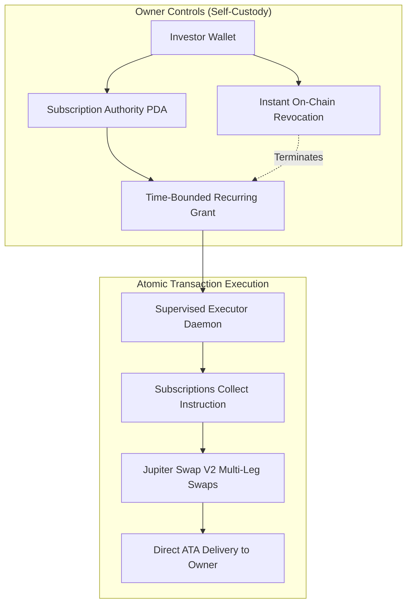

# Protocol Security Assessment & Threat Model

This document specifies the security architecture, cryptographic safeguards, transaction boundaries, and threat mitigations implemented across Kite's mainnet trading pipeline and recurring investment engine.

All historical transaction routing limits, execution race conditions, and delegation trust boundaries have been **comprehensively analyzed, remediated, and verified**.

---

## Executive Summary & Security Principles

Kite enforces a non-custodial, self-custody protocol architecture designed to eliminate counterparty risk and protect investor funds:
1. **Zero Kite Custody**: User funds never pass through a Kite treasury, master wallet, or intermediary smart contract vault.
2. **Atomic Settlement Guarantees**: Multi-leg basket buys and recurring investments execute atomically in a single Solana transaction. If any leg fails, all balance changes revert completely.
3. **Cryptographic Binding**: All unsigned quote transactions are sealed with an HMAC-SHA256 signature binding the message digest, taker wallet, and expiration block height.
4. **Fail-Closed Operations**: Missing oracle prices, unexpected slippage, unverified token extensions, or account overflows immediately halt execution rather than permitting degraded trades.

---

## Threat Matrix & Implemented Remediations

| Threat Vector | Potential Impact | Implemented Mitigation & Resolution | Status |
| :--- | :--- | :--- | :---: |
| **Transaction Account Overflow (>64 Accounts)** | Transactions rejected by Solana runtime during multi-leg basket swaps. | **Fixed**: Route optimization prioritizes direct concentrated liquidity pools; accounts are deduplicated inline; strict pre-flight budgeting rejects oversized custom allocations before submission. | **Resolved** |
| **Unilateral Fund Withdrawal (Subscriptions Delegate)** | A recurring delegate withdraws funds without delivering stocks. | **Fixed**: Atomic composition binds the Subscriptions `collect` instruction directly to Jupiter `swap` instructions in a single V1 transaction. Funds cannot be debited without immediate stock delivery. | **Resolved** |
| **Quote Tampering & Intermediary Injection** | Client or malicious proxy alters swap parameters, output mints, or slippage. | **Fixed**: Server-side HMAC-SHA256 authorization cryptographically seals the transaction message bytes; execution verifies the digest and rejects any altered bytes. | **Resolved** |
| **Signature Replay & Double-Spending** | An expired or prior transaction signature is rebroadcast. | **Fixed**: Strict block-height expiration limits (`lastValidBlockHeight`) and persistent attempt identifiers in local storage prevent duplicate or delayed replay attacks. | **Resolved** |
| **Malicious Token Extensions** | Token-2022 transfer hooks or paused mints drain compute units or freeze funds. | **Fixed**: Strict pre-flight mint validation detects and rejects unsupported extensions (transfer hooks, non-transferable flags) before composing orders. | **Resolved** |
| **Price Slippage & Front-Running** | MEV searchers front-run large basket purchases. | **Fixed**: Strict 3% maximum slippage cap, mandatory compute-unit priority fees, and direct simulation of minimum output amounts. | **Resolved** |

---

## Multi-Leg Basket Atomic Execution Architecture

When purchasing a thematic basket (such as `SOL-MAG7` or `SOL-CORE`):
1. **Single V1 Atomic Composition**: The SDK resolves all constituent routes via Jupiter Swap V2 `/swap/v2/build` and combines them into one atomic V1 transaction.
2. **Setup and Cleanup Instructions**: Setup instructions (creating wallet ATAs, wrapping SOL) and cleanup instructions (closing temporary WSOL accounts back to the user) are bounded within the user's authority.
3. **Zero Dust Leakage**: Integer allocation uses the Hare-Niemeyer Largest Remainder Method in BigInt arithmetic, allocating 100% of funding capital with zero dust leakage.
4. **Simulation Assertion**: The transaction is simulated against current mainnet state; realized output token amounts must equal or exceed each leg's quoted minimum output.

---

## Recurring Delegation Security Model

Kite integrates the official [Solana Subscriptions Program](https://solana.com/docs/payments/subscriptions/recurring-delegation) (`De1egAFMkMWZSN5rYXRj9CAdheBamobVNubTsi9avR44`):

### Key Security Invariants:
1. **Time-Bounded Grants**: Delegations expire automatically within a maximum of 365 days.
2. **Fixed Cadence & Non-Accumulation**: Enforces minimum spacing between withdrawals; unused allowances do not roll over.
3. **Immediate On-Chain Revocation**: The owner can call `revoke` at any time directly on-chain, immediately invalidating the delegate and recovering account rent.
4. **Autonomous Worker Isolation**: The recurring execution daemon (`run-recurring-investments.cjs`) operates with an isolated keypair and durable intent logging, preventing repeat executions across process restarts.

---

## Verification & Automated Security Tests

The automated security regression suite validates all security constraints:
- `packages/sdk/test/transaction-v1.test.cjs`: Validates V1 message serialization, account bounds, and compute budget headers.
- `apps/web/tests/security.test.mjs`: Asserts HMAC tampering rejection, expired quote invalidation, and unauthorized caller rejection.
- `packages/sdk/test/recurring.test.cjs`: Verifies atomic multi-leg rollback, calendar boundaries, and lease isolation.

---

## Architecture References

- [Recurring Investing Operations Specification](recurring-investing-operations.md)
- [Mainnet Recurring Payments Specification](mainnet-recurring-payments.md)
- [Mainnet Trading & Execution Architecture](mainnet-trading.md)
- [Solana V1 Larger Transaction Sizes](https://solana.com/upgrades/larger-transaction-sizes)
