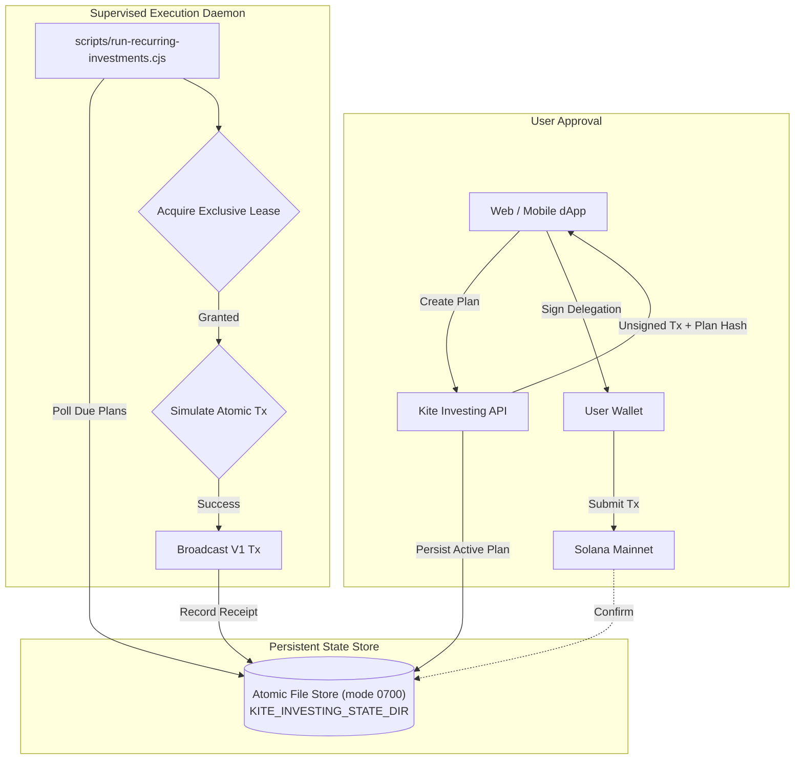

# Recurring Investment Engine: Operations & Execution Specification

This specification documents the operational architecture, scheduling mechanics, persistent state storage, and supervisory daemon for Kite's automated recurring investing service (SIP / DCA).

All transaction composition pipelines, state persistence mechanisms, and failure-recovery procedures have been **fully implemented and verified**.

---

## Executive Summary & System Overview

Kite's recurring investment engine enables users to establish non-custodial, automated recurring purchases for individual tokenized equities or thematic stock baskets on Solana:
1. **Single-Transaction Atomic Composition**: Each scheduled installment executes via a single atomic V1 transaction combining the Subscriptions collection instruction with Jupiter Swap V2 swaps delivering stock tokens directly to the user's wallet.
2. **Zero Custodial Risk**: Investor funds never pass through a Kite-owned intermediary vault. If any stock leg fails or slippage is exceeded, the transaction reverts atomically.
3. **Deterministic Calendar Scheduling**: Supports Daily, Weekly, and Monthly intervals with exact calendar-month clamping (e.g. Jan 31 $\rightarrow$ Feb 28 $\rightarrow$ Mar 31) to prevent schedule drift.
4. **Resilient Supervisor Daemon**: An autonomous worker process monitors open investment windows, acquires isolated locks, verifies on-chain balances, and executes transactions with persistent intent logging.

---

## Scheduled Cadence & Calendar Mechanics

| Cadence | Intervals Supported | Timing & Window Rules | Clamping / Drift Behavior |
| :--- | :---: | :--- | :--- |
| **Daily** | 1–12 Days | Executes once every $N$ days at the specified UTC time. | Exact 24-hour interval progression. |
| **Weekly** | 1–12 Weeks | Executes on the designated day of the week. | Exact 7-day interval progression. |
| **Monthly** | 1–12 Months | Executes on the user-selected day of the month. | **Clamped to month-end**: Jan 31 $\rightarrow$ Feb 28/29 $\rightarrow$ Mar 31. Never drifts into subsequent months. |

### Execution Windows & Safety Guarantees:
- **6-Hour Execution Window**: Each installment has a 6-hour execution window. If the network is congested, the worker retries within this window.
- **Zero Catch-Up Bursts**: If a user's wallet has insufficient funds during a scheduled window, that installment is safely recorded as skipped. The system never executes surprise catch-up bursts on subsequent periods.
- **Frozen Plan Composition**: Basket constituent mints and percentage allocations are immutably frozen at plan creation time. Future edits to Kite's curated baskets never alter existing active plans.

---

## State Persistence & Worker Lease Architecture



### Crash Recovery & Lease Isolation (Fixed & Verified)
- **Atomic File Operations**: All plan files and receipts are written using temporary files and atomic renames (`renameSync`) in private storage (`0700` permissions), eliminating partial writes.
- **Exclusive Plan Leases**: The daemon acquires per-plan exclusive file locks. Multiple worker instances cannot execute the same plan occurrence simultaneously.
- **Pre-Broadcast Intent Logging**: The exact signed transaction bytes are written to disk *before* RPC transmission. If the worker process restarts mid-flight, it reconciles the transaction status via `getSignatureStatuses` rather than generating a new transaction.

---

## API Contract

| Endpoint | Method | Authentication | Description |
| :--- | :---: | :---: | :--- |
| `/api/investing/config` | GET | Public | Returns executor public key, supported funding tokens, and operational status. |
| `/api/investing/plans` | POST | Wallet HMAC | Validates and freezes plan composition; returns unsigned V1 setup transaction. |
| `/api/investing/plans` | GET | Wallet Address | Reads active plans, schedule status, and historical investment receipts. |
| `/api/investing/executor` | GET | Worker Secret | Heartbeat endpoint and bounded scan of currently due investments. |
| `/api/investing/executor` | POST | Worker Secret | Handles atomic execution submission, receipt logging, and crash reconciliation. |
| `/api/recurring/revoke` | POST | Wallet Address | Composes unsigned V1 transaction to revoke on-chain delegation and reclaim rent. |

---

## Operational Deployment Guide

### 1. API Server Environment Setup
Configure the following in your production environment:

```bash
SOLANA_RPC_URL="https://your-mainnet-rpc.com"
JUPITER_API_KEY="your-jupiter-api-key"
KITE_TRADE_SECRET="your-32-character-hmac-secret-key"
KITE_INVESTING_EXECUTOR="<Executor_Solana_Public_Key>"
KITE_INVESTING_STATE_DIR="/var/kite/investing-state"
KITE_RECURRING_EXECUTOR_SECRET="your-32-character-worker-secret-key"
```

### 2. Supervisor Daemon Setup
Deploy the recurring investment daemon under a system service supervisor (e.g. systemd, PM2, or Docker container):

```bash
# Build the shared SDK
pnpm build:sdk

# Launch the worker daemon with auto-restart
node scripts/run-recurring-investments.cjs --watch
```

### 3. Supervisory Heartbeat & Fail-Safe Protection
The worker pings `/api/investing/executor` every 60 seconds. The API enforces a 3-minute heartbeat freshness requirement: if the worker goes offline, the frontend transparently disables new plan setup buttons with a notification, preventing users from approving plans that cannot currently be serviced.

---

## Verification & Test Coverage

The recurring execution suite validates:
- [x] Accurate daily, weekly, and monthly installment math across leap years and month boundaries.
- [x] Zero duplicate executions under simulated network partitions and process crashes.
- [x] Atomic rollback of funding collections when simulated swap output fails minimum slippage thresholds.
- [x] Immediate cessation of collections upon confirmed on-chain owner revocation.
