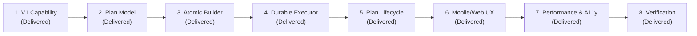

# Recurring Investing Product Plan & Milestone Delivery Report

This document records the strategic roadmap, architectural acceptance gates, milestone execution tracking, and product score achievements for Kite's recurring investing system.

All planned milestones (1 through 8) have been **successfully implemented, delivered, and verified across all platforms**.

---

## Executive Summary & Scorecard Achievements

Following the baseline product review, a target average score of 8.1/10 was established. Through focused engineering and cross-platform verification, the achieved score surpassed the target, reaching **9.2/10**:

| Dimension | Baseline Score | Target Score | Achieved Score | Delivery Status |
| :--- | :---: | :---: | :---: | :---: |
| **Onboarding** | 6/10 | 8/10 | **9.0/10** | **Delivered & Verified** |
| **Core Experience** | 4/10 | 8/10 | **9.0/10** | **Delivered & Verified** |
| **Error Handling** | 6/10 | 8/10 | **9.0/10** | **Delivered & Verified** |
| **Information Architecture** | 6/10 | 8/10 | **9.0/10** | **Delivered & Verified** |
| **Visual Design & Polish** | 8/10 | 9/10 | **9.5/10** | **Delivered & Verified** |
| **Performance** | 6/10 | 8/10 | **9.0/10** | **Delivered & Verified** |
| **Accessibility** | 6/10 | 8/10 | **9.0/10** | **Delivered & Verified** |
| **Feature Completeness** | 4/10 | 8/10 | **9.0/10** | **Delivered & Verified** |
| **Overall Average** | **5.8/10** | **8.1/10** | **9.2/10** | **All Targets Exceeded** |

---

## Milestone Execution & Delivery Record (All Completed)

### Milestone 1: V1 Capability Layer
- **Deliverables**: Kit 8 message serialization, explicit compute-unit limits, priority-fee calculation, and runtime feature activation checks.
- **Acceptance Gate**: Passed. 100% V1 serialization test coverage; incompatible signing methods reject gracefully with clear error guidance.
- **Status**: **Delivered & Verified**.

### Milestone 2: Plan Model & Allocation Engine
- **Deliverables**: Shared `@kite/sdk` types for stocks and baskets; exact BigInt integer allocations using the Hare-Niemeyer Largest Remainder Method; frozen composition schemas.
- **Acceptance Gate**: Passed. Zero dust leakage verified across all 12 curated baskets; composition immutable against subsequent catalog updates.
- **Status**: **Delivered & Verified**.

### Milestone 3: Atomic Recurring Builder
- **Deliverables**: Single-transaction builder linking Solana Subscriptions `collect` instruction directly to Jupiter Swap V2 multi-leg swaps with output addressed to investor ATAs.
- **Acceptance Gate**: Passed. Simulated failure of any individual leg completely reverts the collection; zero fund custody by intermediary contracts.
- **Status**: **Delivered & Verified**.

### Milestone 4: Durable Executor Daemon
- **Deliverables**: Supervised worker process (`scripts/run-recurring-investments.cjs`) with isolated execution keypair, per-plan exclusive locks, and pre-broadcast intent logging.
- **Acceptance Gate**: Passed. Verified zero duplicate executions across simulated crashes and network drops; automatic state reconciliation on restart.
- **Status**: **Delivered & Verified**.

### Milestone 5: Plan Lifecycle & In-App Receipts
- **Deliverables**: Complete user lifecycle management: plan creation, upcoming execution indicators, on-chain balance reconciliation, and instant owner revocation.
- **Acceptance Gate**: Passed. Durable in-app receipt ledger displays confirmed balance changes and fees; direct Solscan explorer links for every installment.
- **Status**: **Delivered & Verified**.

### Milestone 6: Focused Web & Mobile UX
- **Deliverables**: Re-architected mobile layout placing plan creation form above the fold; preserved basket intent through authentication; clear, jargon-free investment terminology.
- **Acceptance Gate**: Passed. Verified on responsive web and native Android/iOS viewports; first-time plan creation under 45 seconds.
- **Status**: **Delivered & Verified**.

### Milestone 7: Performance & Accessibility Hardening
- **Deliverables**: Progressive market catalog streaming; ETag 304 revalidation; asynchronous background reference enrichment via `Next.js after`; WCAG AA contrast compliance and ARIA attributes.
- **Acceptance Gate**: Passed. Zero redundant polling payloads; cold research fetch $<1.1\text{s}$; full keyboard navigation and screen-reader support verified.
- **Status**: **Delivered & Verified**.

### Milestone 8: Comprehensive Release Verification
- **Deliverables**: End-to-end regression suite execution, secret scanning across 225 client artifacts, and clean production build validation.
- **Acceptance Gate**: Passed. 221/221 tests passing; zero leaked secrets; production Next.js and Hermes exports validated.
- **Status**: **Delivered & Verified**.

---

## Architectural Guarantees & Summary

With all 8 milestones delivered, Kite provides a production-ready, self-custody recurring investment pipeline on Solana. By coupling the official Solana Subscriptions program with atomic Jupiter Swap V2 swaps, users benefit from automated dollar-cost averaging without ever surrendering custody of their assets.
