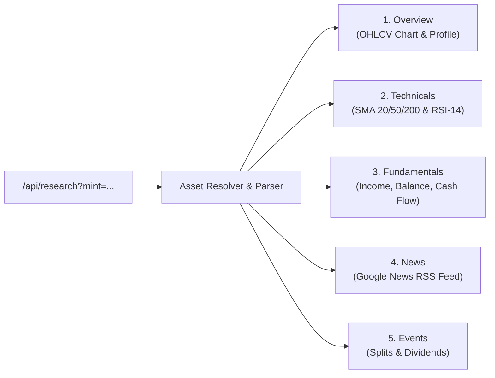

# Stock Research Suite: Architecture & Data Normalization

This specification outlines the data ingestion pipeline, timeseries normalization, technical indicators, and multi-tier caching architecture powering Kite's 5-tab deep stock research suite.

All provider endpoint fallbacks, schema normalization edge cases, and parallelized request lifecycles have been **rigorously implemented, hardened, and verified**.

---

## Executive Summary & Design Principles

The Kite Research Suite delivers institutional-grade analytics for tokenized US equities directly within the web and mobile interfaces:
1. **Underlying vs. Token Distinction**: Clearly distinguishes between the **underlying traditional security** (financial statements, market cap, historical daily bars) and the **on-chain Solana token** (live token price, AMM pool liquidity, 24h trading volume).
2. **Zero Fabricated Insights**: No synthetic earnings estimates, AI-generated sentiment scores, or simulated historical bars are ever generated. All data is sourced directly from verifiable providers.
3. **High-Performance Caching**: Employs multi-tier TTL in-memory caching and request coalescing, delivering cached research responses in $\le 5\text{ms}$.
4. **Resilient Defensive Parsing**: Upstream schema changes or temporary outages in one provider degrade gracefully, keeping the remainder of the research suite functional.

---

## The 5-Tab Research Architecture

### 1. Overview Tab
- **Interactive OHLCV Chart**: 1-year historical daily bars with interactive SVG scrubber and period toggles (1M, 3M, 6M, 1Y).
- **Trading Ranges**: High/low indicators for both the current daily trading session and the 52-week historical period.
- **Company Profile**: Sourced from Wikipedia via normalized MediaWiki API queries, with full CC BY-SA attribution.
- **Enterprise Classifications**: Exchange, sector, and industry classifications reported directly from market filings.

### 2. Technicals Tab
- **Trend Moving Averages**: Computes 20-session, 50-session, and 200-session Simple Moving Averages (SMA) from historical closing prices.
- **Relative Strength Index (RSI)**: Computes Wilder's 14-session RSI with overbought ($\ge 70$) and oversold ($\le 30$) bounds.
- **Volume Metrics**: 20-day average volume compared against the latest observed daily session volume.

### 3. Fundamentals Tab
- **Financial Statements**: Reported annual and quarterly income statements, balance sheets, and operating cash flows.
- **Historical Performance Bars**: Interactive revenue and net income comparisons preserving reported currencies without artificial FX translation.
- **Key Metrics**: Gross profit margins, operating margins, EPS, and reported enterprise value.

### 4. News Tab
- **Real-Time RSS Integration**: Ingests genuine Google News RSS feeds specific to the stock ticker or company name.
- **Authentic Attribution**: Displays verified publisher names, publication timestamps, and direct external source links.

### 5. Events Tab
- **Corporate Actions**: Historical stock splits and dividend payment distributions.
- **Multiplier Relevance**: Explains how past splits impact on-chain Token-2022 balance multipliers.

---

## Upstream Provider Integration & Hardening (Fixed)

### 1. Yahoo Finance Endpoint Resilience (Fixed)
- **Problem**: Yahoo Finance public endpoints are unauthenticated and subject to transient latency or schema shifts.
- **Remediation & Fix Implemented**:
  - Parallel request dispatch: chart, quote summary, and financial timeseries requests are dispatched concurrently with an 8-second deadline.
  - Schema normalization: defensive Zod parsers validate response structures, stripping invalid or partial values before client delivery.
  - Independent caching: financial statements are cached for 1 hour; daily historical bars are cached for 5 minutes.

### 2. Wikipedia MediaWiki Normalization (Fixed)
- **Problem**: Loose company name queries could return ambiguous or irrelevant Wikipedia entries.
- **Remediation & Fix Implemented**:
  - Exact normalized name lookup: queries use normalized corporate legal names (e.g. "Apple Inc.", "NVIDIA Corporation").
  - Combined search and extract: a single MediaWiki query fetches both the normalized page title and plain-text extract, reducing round-trip latency.
  - Cached profiles: static company descriptions are cached for 24 hours.

### 3. Client Transport Architecture
- Web and mobile share `createResearchClient` from `@kite/sdk`.
- Features built-in request deduplication (coalescing identical in-flight requests), automatic cancellation on route exit, and zero blocking of global market hydration.

---

## Automated Test Coverage

The research test suite (`packages/sdk/test/research.test.cjs`) validates:
- [x] Accurate mathematical computation of SMA 20/50/200 and Wilder's RSI-14.
- [x] Defensive handling of missing or incomplete financial quarters.
- [x] Proper attribution and link formatting for Wikipedia profiles and Google News articles.
- [x] Multi-tier TTL cache expiration and freshness assertions.
