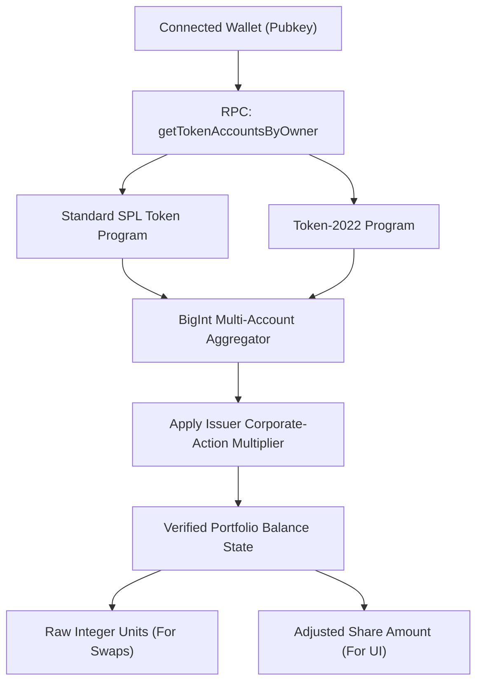

# Wallet Holdings & Mainnet Swaps Architecture Specification

This specification documents the multi-token portfolio balance resolution, Token-2022 scaled balance normalization, transaction simulation guards, and wallet execution safeguards implemented in Kite.

All precision handling, ATA route setup instructions, and pending execution state machines have been **rigorously implemented, tested, and verified**.

---

## Executive Summary & Design Principles

Kite's wallet integration provides a transparent, non-custodial interface for interacting with Solana equities, standard SPL tokens, and Token-2022 assets:
1. **Multi-Program Portfolio Aggregation**: Reads both standard SPL Token and Token-2022 accounts owned by the connected wallet in a single RPC pass via `getTokenAccountsByOwner`.
2. **Exact Decimal Conversion**: All calculations use integer BigInt math, strictly preventing IEEE-754 floating-point rounding errors.
3. **Automated Account Setup & Cleanup**: The transaction builder automatically detects missing destination Associated Token Accounts (ATAs) and appends idempotent initialization instructions. Temporary Wrapped SOL (WSOL) accounts are unwrapped back to the native wallet in cleanup instructions.
4. **Resilient Pending Guards**: Prevents duplicate submissions by persisting pending transaction states across browser reloads and native app restarts.

---

## Multi-Token Balance Resolution Architecture

### 1. Corporate Actions & Multiplier Resolution (Fixed & Handled)
- **Problem**: Stock splits alter share balances without changing historical on-chain token counts. Multiplying quoted share prices by raw token balances produces distorted portfolio valuations.
- **Resolution (Fixed)**:
  - Kite strictly differentiates between **raw token lamports** and **adjusted equity share units**.
  - Transactions always execute in exact raw token units.
  - The portfolio display applies the verified issuer corporate-action multiplier, ensuring accurate equity valuations.

### 2. High-Precision Decimal Math (Fixed & Handled)
- **Problem**: Floating-point arithmetic in JavaScript can introduce precision errors during currency and token conversions.
- **Resolution (Fixed)**:
  - All token quantities are parsed into exact BigInt raw units:
    $$\text{Raw Units} = \text{Decimal Input} \times 10^{\text{decimals}}$$
  - Tokens with standard decimals (up to 18 decimals) are fully supported with exact integer division and largest-remainder distribution.

### 3. Native SOL Max Buffer Safeguard
- When a user selects "Max" on a native SOL holding, Kite preserves a conservative buffer ($0.01\text{ SOL}$) to cover rent for newly opened token accounts and Solana transaction network fees.
- Prevents users from locking their wallets by accidentally exhausting all SOL required to pay gas.

---

## Approval, Pre-Flight Simulation, and Broadcast

### 1. Mandatory Mainnet Simulation
Before prompting the user to sign a transaction, the server executes a pre-flight simulation (`simulateTransaction`):
- **Balance Verification**: Asserts that the payer possesses the required input tokens.
- **Output Thresholds**: Validates that the realized output token amount meets or exceeds the quoted minimum output (capping slippage at 3%).
- **Account Authority**: Verifies that all destination ATAs are owned by the connected wallet.

### 2. Server HMAC Authorization
- Unsigned transaction messages are sealed with an HMAC-SHA256 authorization generated by `KITE_TRADE_SECRET`.
- Cryptographically binds the wallet address, serialized message digest, and block-height expiration limit.
- Any client-side tampering with transaction instructions or destination addresses immediately invalidates the HMAC signature.

### 3. Persistent Pending Execution Guards (Fixed)
- **Problem**: Network drops or accidental page refreshes during wallet approval can lead users to suspect a failure and re-submit an order.
- **Resolution (Fixed)**:
  - Transaction attempt identifiers and signatures are durably saved to `localStorage` (web) or `AsyncStorage` (mobile) *before* broadcast.
  - On page reload or app restart, Kite detects the active attempt, locks the swap form, polls Solana mainnet RPC for signature status, and provides a direct Solscan link once confirmed.

---

## Automated Verification & Test Coverage

The wallet and swap regression suite (`packages/sdk/test/accounting.test.cjs` and `apps/web/tests/`) validates:
- [x] Accurate BigInt multi-account aggregation across SPL and Token-2022 programs.
- [x] Zero precision loss on high-decimal token pairs.
- [x] Preservation of native SOL gas buffer on "Max" button clicks.
- [x] Rejection of tampered transaction messages and expired HMAC quotes.
- [x] Crash-recovery and automatic signature reconciliation across simulated restarts.
